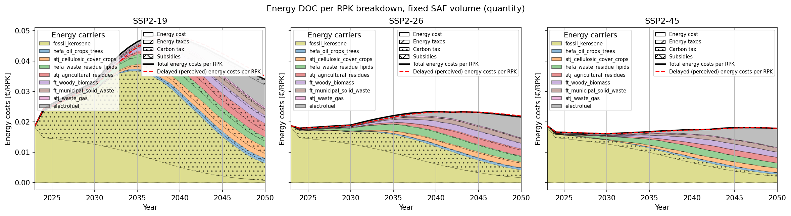
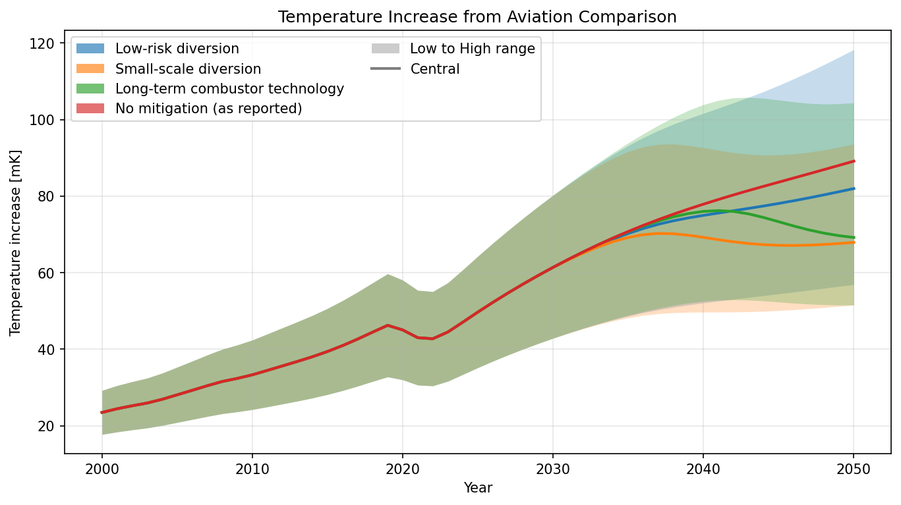
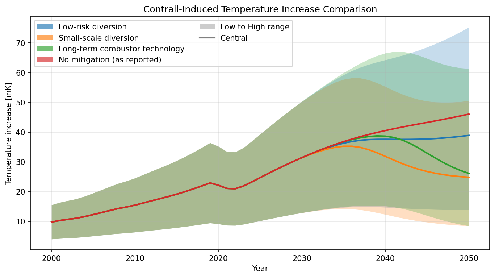

## Abstract

Several actors have drafted diverging visions for the future climate impact of air transport. This
paper aims to: to review ATAG Waypoint 2050 scenarios across the three editions of the report, while
quantifying emissions reductions achieved from each of the mitigation levers presented. The
methodology behind reproduction is described, scenarios are simulated using the AeroMAPS open-source
framework, and extensions of the Waypoint scope is presented by: coupling traffic growth to rising
energy costs, and incorporating contrails avoidance.
 {raw:typst}`#text(fill: rgb("#c00000"))[`<span style="color:#c00000">The three published scenarios reproduce to well-to-wake residuals of about 1,800, 640 and 520 MtCO₂ in 2050, above the reports' tank-to-wake headlines as the change of accounting scope requires. Sweeping the full lever grid places those three points inside a range spanning 343 to 2,164 Mt, so the published scenarios are a sparse sample of their own design space rather than its bounds. Closing the demand–price loop the reports leave open reduces 2050 traffic by 11 to 20 % depending on the carbon price, recovering the magnitudes they cite from other studies but decline to model. Extending the climate accounting shows the sharper result: the non-CO₂ uncertainty band on a single scenario is about 3.4 times wider than the entire spread between the published scenarios, so the choice between them is currently a smaller question than the uncertainty each carries.</span>{raw:typst}`]`
While the ATAG reports address the modeling methods used for the quantification of aviation
emissions, there is limited transparency in the provenance of data, calibration methodology, and
mathematical formulation, which further difficult comparisons and their overall impact for policy
purposes. On this front, authors advocate for the use of open-source and open-data, which are
greatly beneficial to explicit assumptions and finding a common ground for high-level decision
making.

## Authorship of this draft

This document follows the structure of the manuscript in preparation. Text in **black** is the
author's own, carried across unchanged apart from mechanical transcription from LaTeX to MyST
(`\cite{key}` becomes `` {cite:p}`key` ``, `$\text{CO}_2$` becomes CO2, and so on).

{raw:typst}`#text(fill: rgb("#c00000"))[`<span style="color:#c00000">Text in this colour was drafted by an AI assistant, filling the `+` placeholders left in the manuscript. Every number in it is read from a committed scenario output and is reproducible from the notebook named alongside it; the prose around those numbers is a draft for the author to accept, rewrite or discard.</span>{raw:typst}`]`

Two mechanical notes. `lee_contribution_2021` is cited here as `lee2021`, the same paper under the
key this repository already uses. And the citations filling the author's inline `+cite` markers are
set in black rather than colour, because a colour span containing nothing but a citation does not
survive the PDF export; the references chosen at those four markers are
{cite:p}`eu_nonco2_mrv` for non-CO2 monitoring, {cite:p}`teoh2020,icao_corsia_2022` for contrail
avoidance crediting, {cite:p}`lee2021,teoh2024,icct_vision2050_2022` for the missing climate
accounting, and {cite:p}`gossling_humpe_2020,destination2050_2021` for demand feedback.

## Introduction

Historically the aviation sector witnessed significant environmental efficiency gains: in 2019 the
fuel burn per Revenue Passenger-Kilometer (RPK) reached 44 % (less than half) of its 1990 value
{cite:p}`bergero_pathways_2023`. These gains, driven by aircraft and propulsion technology, along
with operational efficiency, are significant when compared to other transportation modes
{cite:p}`eu-transport-efficiency`, where aviation shows the highest gains. Despite such efforts, the
CO₂ emissions of the sector increased 89 % (almost doubled) in the same period, as air traffic
demand significantly outpaced fuel burn reductions: from 1990 to 2019 RPK increased by 338 %.
However, CO₂ is only half of the story. From 1940 to 2018 only 34 % of aviation cumulative forcing
(expressed as net effective radiative forcing, ERF) came from CO₂ alone, the remaining 66 %
originating from non-CO₂ effects, although their associated uncertainty is roughly 8 times larger
than that of CO₂ {cite:p}`lee2021`. Furthermore, while mitigation levers that tackle CO₂ may also
reduce non-CO₂ to some extent, this is still subject to ongoing research.

Achieving the Paris Agreement targets requires deep, rapid, and sustained emissions reductions
across all economic sectors. Aviation is considered a hard-to-abate sector whose mitigation relies
on a few levers with opposing effects on the cost of flying {cite:p}`delbecq_sustainable_2023`:
Sustainable Aviation Fuels (SAF) and carbon pricing and Market-based measures (MBM) raise this cost,
while operational and vehicle efficiency are expected to lower the impact of increased fuel prices
to airlines and travelers. Besides its decarbonization policy, specific measures to tackle non-CO₂
are currently being formulated for monitoring these effects {cite:p}`eu_nonco2_mrv` and for allowing airlines to claim carbon allowances from
contrail avoidance strategies {cite:p}`teoh2020,icao_corsia_2022`.

Among the numerous industrial, institutional, and academic scenarios have been made for aviation,
the Air Transport Action Group (ATAG) Waypoint 2050 stands as the industry vision of the transition
of the sector up until 2050. While the three different editions of the report
{cite:p}`atag2020_waypoint,atag2021_waypoint,atag2026_waypoint` are rich in detail and figures for
the future 25 years the methods and underlying assumptions are not always explicit nor reproducible.
In the context where national and international policies are derived from such, we argue for more
openness regarding: models, data, background assumptions, limitations, and uncertainties.
Furthermore, as highlighted by many academic works, these institutional scenarios also lack
accounting of the full climate impacts of aviation {cite:p}`lee2021,teoh2024,icct_vision2050_2022`, and for the feedback of
policy-induced price increases on traffic demand {cite:p}`gossling_humpe_2020,destination2050_2021`.

This work asks whether the ATAG third-edition scenarios can be reproduced transparently, lever by
lever, in the AeroMAPS {cite:p}`planes_aeromaps_2023` open-source framework.
Furthermore, extra capabilities of the framework are employed to demonstrate two points that lack in
all ATAG reports: analysis of demand-side impacts of transition costs, and quantification of
temperature impacts of scenarios with different strategies for contrail avoidance.

### ATAG Waypoint Reports

The first edition of the ATAG Waypoint 2050 report {cite:p}`atag2020_waypoint` was launched in
September 2020 during the COVID-19 crisis, when aviation experienced its greatest drop in traffic
levels seen in recent history. The report frames the pandemic as an opportunity for a "green
recovery" as the social function of air travel was put in question. By then, the official target was
to halve 2005 emission levels by 2050, and the sector's position as a hard to abate sector is
emphasized, mentioning that net zero could be achieved by 2060-2065. Four prospective scenarios are
presented:

- **S0: baseline/continuation of current trends** — Central range for traffic forecasts,
  conservative operational and technology improvements with a new generation of new aircraft to
  entry into service by 2030-2035, deployment of SAF based on current rates, and carbon offsets are
  used as the principal lever to align emissions to emission reduction goals;
- **S1: pushing technology and operations** — Ambitious operational and technological improvements
  with unconventional aircraft (hybrid-electric) to entry into service by 2035-2040, deployment of
  SAF is supposed to align scenario to industry goal by 2050, and offsets are used as a transition
  mechanism until 2050;
- **S2: aggressive sustainable fuel deployment** — Ambitious operational and technological
  improvements with disruptive aircraft configurations (blended wing body), but only using
  conventional propulsion based on jet-fuel, SAF deployment is accelerated and is supposed to align
  scenario to goals by 2035, offsets are used as a transition mechanism until 2035;
- **S3: aspirational and aggressive technology perspective** — Very ambitious technology
  improvements with larger deployment of unconventional aircraft (liquid hydrogen and
  hybrid-electric), SAF deployment is slower and partially aligns emissions to goals by 2050,
  offsets are used as a transition mechanism until 2050.

By 2021, IATA member airlines increased their climatic ambition by adopting net-zero emissions by
2050 as a target {cite:p}`iata2021_netzero`, and a new edition was published on the same year
{cite:p}`atag2021_waypoint`. The second edition reuses the same scenario definitions as the first
one, but when quantifying the role of each mitigation lever, it lowers expected emissions reductions
for operations and technology, and significantly increases the expected reductions from deploying
SAF, the need of carbon offsets is also revised upwards as no scenario reaches the new goal of net
zero without recurring to them.

Finally, the third edition was launched in 2026, as traffic levels are reaching all-time records
after the recovery from the pandemic crisis, and assumes a position more focused on practical
implementation of policies and the necessary regulatory framework to turn vision into reality. This
edition removes the S3 scenario, to reflect delayed expectations for aircraft with unconventional
propulsion systems, and switched the ordering and naming of scenarios: the **S1: focus on SAF
deployment** is inspired on the S2 of previous versions, and **S2: technology-centric market**
similar to the previous S1. Regarding the extent of each of the mitigation levers, both operations
and technology display similar expectations compared to their analogous scenario in the previous
version, SAF deployment is revised to reflect delays due to policy coordination failures and
investment bottlenecks, but is still seen as the main lever for emissions reductions and delays are
compensated by assuming a stronger ramp-up of production volumes. The role of offsets is also
revised upwards and with more detailed modeling to reflect current policies: regionally-resolved
offsets are estimated based on the implementation of CORSIA for international aviation until 2035,
and an extra policy is assumed to be put in place after that to allow for reaching net-zero by 2050.

{raw:typst}`#text(fill: rgb("#c00000"))[`<span style="color:#c00000">Two features of that trajectory deserve to be named as critiques rather than described as revisions. The first is that SAF's assigned role *grows* in each edition while the evidence for delivering it weakens: the third edition documents policy coordination failures and investment bottlenecks, delays the ramp accordingly, and then compensates by assuming a steeper subsequent climb to the same or a larger 2050 volume. Delay is absorbed by optimism about the recovery rather than propagated into the outcome. The second is that traffic is exogenous in all three editions. Demand follows central industry forecasts unaffected by transition costs, even though the same reports assume an energy carrier several times costlier than kerosene and a carbon price rising to hundreds of dollars per tonne. Each lever is scored against a traffic volume it would itself help suppress, which systematically overstates the abatement the levers must deliver.</span>{raw:typst}`]`

```{code-cell} python
:tags: [hide-input]

from pathlib import Path

import matplotlib.pyplot as plt
import pandas as pd

from aeromaps import assemble_processes
from aeromaps.utils.results_view import load_results

HERE = Path.cwd()


def results(edition, scenario, label, produced_by):
    """Load a committed scenario, or explain what to run if it is not there yet."""
    path = HERE / edition / "data_outputs" / f"{scenario}.json"
    if not path.exists():
        print(f"PENDING: {path.relative_to(HERE)} has not been generated yet.\n"
              f"         Run {produced_by} to produce it.")
        return None
    return load_results(path, name=label)


S0 = results("3rd_edition_light", "s0", "S0 reference", "3rd_edition_light/s0.ipynb")
S1 = results("3rd_edition_full", "s1", "S1 SAF-focused", "3rd_edition_full/s1.ipynb")
S2 = results("3rd_edition_full", "s2", "S2 technology-centric", "3rd_edition_full/s2.ipynb")

scenarios = {view.name: view for view in (S0, S1, S2) if view is not None}
print(f"loaded {len(scenarios)} scenarios: {', '.join(scenarios)}")
```

## Materials and Methods

Prospective analysis requires a mathematical model capable of describing: how the current reality
was reached from a past state, as well as which future realities may be reached from current state.
Furthermore, in the case where disruptions in past trends are foreseen, possible evolution paths of
associated drivers must be quantified as well as their system-level impacts. In doing so, if impacts
are great enough to invalidate assumptions established by the mathematical model, a new model
proposition has to be made, and the cycle is repeated.

This means that both the analysis and the models used for it are continuously improved, however,
most prospective groups treat the problem as a sequential problem: models are calibrated based on
the past, future drivers are quantified, impacts are assessed, and model assumptions remain
unchanged. Different exercises of the same method differ only on which novel data and insights are
accounted for, but they do not inform on the goodness of the exercise itself.

Methodologically, this paper employs the similar sequential approach for reproducing ATAG Waypoint
scenarios with the AeroMAPS framework, as well as for calibrating model parameters which are omitted
by the reports. Furthermore, the framework is employed to demonstrate how to break out of the
sequential approach by removing one key assumption kept by all three editions: that traffic growth
won't be affected by rising transition costs. "Omitting key variables simply because data are
lacking is effectively equivalent to assigning them a value of zero, arguably the only value that is
certain to be incorrect" {cite:p}`sterman2000`.

### AeroMAPS

{raw:typst}`#text(fill: rgb("#c00000"))[`<span style="color:#c00000">AeroMAPS {cite:p}`planes_aeromaps_2023` is an open-source sectoral integrated assessment model for air transport, distributed under an open licence with its input data. It is organised as a set of interconnected modules rather than a single monolithic calculation: air traffic and its market segmentation; the aircraft fleet and its operations; energy carriers, their production processes and the resources those consume; and downstream impact modules for emissions, life-cycle assessment {cite:p}`pollet_lca_2024`, cost {cite:p}`salgas_techno-economic_2025`, abatement cost {cite:p}`salgas_macc_2024` and climate {cite:p}`arriolabengoa_climate_2024`.</span>{raw:typst}`]`

{raw:typst}`#text(fill: rgb("#c00000"))[`<span style="color:#c00000">Two architectural properties matter for a reproduction exercise. First, modules are declared with explicit inputs and outputs and assembled into a computation graph, which is resolved by a multidisciplinary analysis (MDA) solver rather than executed in a fixed order. Feedback loops are therefore expressible: the demand–price coupling used later in this paper is a fixed point that the solver converges, not a post-processing correction. Second, several modules are available at more than one fidelity — energy carriers, for instance, can be described top-down by an aggregate cost and emission factor per unit energy, or bottom-up from plant capital expenditure, operating costs and construction lead times. The reproduction here uses the top-down formulation throughout, because that is the resolution at which the reports themselves publish.</span>{raw:typst}`]`

{raw:typst}`#text(fill: rgb("#c00000"))[`<span style="color:#c00000">The scenario definition lives entirely in declarative files — a YAML configuration selecting the module chain and its data files, a JSON file of parameter trajectories, and YAML descriptions of energy carriers, processes and resources. No scenario in this paper required modifying model code, which is what allows the full lever grid to be swept by generating configurations programmatically.</span>{raw:typst}`]`

### Validation

{raw:typst}`#text(fill: rgb("#c00000"))[`<span style="color:#c00000">Reproducing a scenario whose inputs are not published requires being explicit about where every number came from, because the provenance changes what agreement can be claimed. Four classes are distinguished here, in decreasing order of confidence.</span>{raw:typst}`]`

{raw:typst}`#text(fill: rgb("#c00000"))[`<span style="color:#c00000">**Read from the text.** Operational assumptions are stated numerically in the reports and are used as given: the operations lever is defined as a cumulative efficiency gain of 0.00, 0.10 and 0.20 % per year to 2050 for its three variants, entering the model directly as `operations_gain_reference_years_values`.</span>{raw:typst}`]`

{raw:typst}`#text(fill: rgb("#c00000"))[`<span style="color:#c00000">**Digitised from published figures.** Traffic, load factor and SAF deployment trajectories appear only as charts, and were digitised point by point. Digitisation error is bounded by the resolution of the published figures but is not eliminated, and it propagates into every downstream result.</span>{raw:typst}`]`

{raw:typst}`#text(fill: rgb("#c00000"))[`<span style="color:#c00000">**Calibrated to match figures.** Annual fuel-burn efficiency gains and the deployment schedules for battery-electric and liquid-hydrogen aircraft are never disclosed as values. They were fitted so that each technology variant's emissions trajectory reproduces the digitised one while staying inside published literature ranges. Agreement here demonstrates *consistency*, not recovery of the report's actual assumptions: different technology–fleet combinations produce identical emissions paths, and no identifiability is claimed.</span>{raw:typst}`]`

{raw:typst}`#text(fill: rgb("#c00000"))[`<span style="color:#c00000">**AeroMAPS defaults.** Fleet renewal rates and the aircraft-level performance model are the framework's own, because the reports disclose nothing that would constrain them.</span>{raw:typst}`]`

```{important}
**SAF resolution differs across the grid.** F2 and F3 are published as quantities *per pathway*, so
they map onto the eleven-carrier energy files. F1 publishes only a *total* volume with no pathway
breakdown, so it is modelled as a single generic SAF carrier, reusing the light edition's S0 energy
file rather than inventing a pathway split. Pathway-level outputs are therefore undefined for F1, and
comparisons across the SAF axis stay on totals.
```

{raw:typst}`#text(fill: rgb("#c00000"))[`<span style="color:#c00000">The reports define their scenarios as combinations of five levers, and each maps onto a single knob in AeroMAPS. That correspondence is what makes both the reproduction and the systematic sweep tractable.</span>{raw:typst}`]`

| Lever | Variants | AeroMAPS knob |
|---|---|---|
| Traffic | low / central / high | `markets/markets_{low,central,high}.yaml` |
| Technology | T0–T4 | efficiency series in `*_inputs.json` |
| Operations | O1 / O2 / O3 — 0.00 / 0.10 / 0.20 %/yr | `operations_gain_reference_years_values` |
| SAF | F1 / F2 / F3 | `energy_carriers_model_data_file` |
| Market-based measures | M1 / M2 / M3 | computed as the residual to the target |

{raw:typst}`#text(fill: rgb("#c00000"))[`<span style="color:#c00000">The three published scenarios are points on this grid: **S0** = C·T2·O2·F1·M1, **S1** = C·T3·O3·F2·M2, **S2** = C·T4·O3·F3·M3. Market-based measures are not swept independently because they are computed as the residual needed to reach the stated target, so they carry no free degree of freedom.</span>{raw:typst}`]`

### Coupling traffic and prices

Elasticity calibrated on a global level, based on jet fuel prices, efficiency gains, population, and
per-capita income {cite:p}`gossling_humpe_2020,brons2002,intervistas2007,gillingham2016`.

{raw:typst}`#text(fill: rgb("#c00000"))[`<span style="color:#c00000">The mechanism is a closed loop rather than a correction applied afterwards. A carbon price raises the energy component of direct operating cost per available seat-kilometre; that propagates to net cost per revenue passenger-kilometre; a first-order lag converts cost into the fare travellers actually face; a price index relative to a reference year drives demand through the calibrated elasticity; and the resulting traffic feeds back into fuel burn, energy demand and therefore cost again. The loop is closed by the model's MDA solver as a fixed point, so the reported traffic is self-consistent with the cost of achieving the scenario's own abatement.</span>{raw:typst}`]`

## Results

{raw:typst}`#text(fill: rgb("#c00000"))[`<span style="color:#c00000">The reproduction is presented lever by lever, in the order the reports themselves use, and then extended in two directions the reports place out of scope. Every figure below reads a committed scenario output; no model is executed while this document builds, and each result names the notebook that produced it.</span>{raw:typst}`]`

{raw:typst}`#text(fill: rgb("#c00000"))[`<span style="color:#c00000">Across the three editions the physical levers moved remarkably little while the accounting around them moved a great deal. Traffic forecasts are essentially unchanged in shape, differing mainly in where the COVID recovery is anchored. Technology and operations were revised *downwards* between the first and second editions and then held roughly constant into the third. What changed is the allocation of the residual: as the target was raised from halving 2005 emissions to net zero, the additional burden fell almost entirely on SAF and on market-based measures — the two levers whose feasibility depends least on aircraft engineering and most on energy supply, capital and policy. A roadmap that redraws its baseline while holding its terminal target will report shifting lever contributions even when nothing physical has changed, so cross-edition comparisons are comparisons between accounting conventions at least as much as between technical expectations.</span>{raw:typst}`]`

```{important}
**Read the accounting scope before comparing residuals.** The reports headline *tank-to-wake*
emissions, following the CORSIA methodology: SAF is credited through a lower life-cycle factor, but
the figure quoted is combustion. The scenarios reproduced here are *well-to-wake* — they carry each
pathway's full life-cycle emission factor — so their residuals are **expected to sit above** the
report's numbers, not alongside them. S1 reproduces at about 640 Mt in 2050 against a reported
~400 Mt tank-to-wake; S0 at about 1,800 Mt against ~1,150–1,350 Mt.

This is worth stating explicitly because the opposite pattern was, for a while, exactly what this
reproduction produced. A misspelled key (`co2_emission_factor_without_resource` where the model
reads `mean_co2_emission_factor_without_resource`) meant every biomass SAF pathway was silently
assigned a **zero** emission factor — the model resolves a missing key to a null series rather than
raising. S1 then read 386 Mt, which sat comfortably next to the reported ~400 Mt and looked like
agreement. It was not: a well-to-wake figure matching a tank-to-wake one is the anomaly, and it went
unremarked because the number looked right.
```

```{code-cell} python
:tags: [hide-input]

# Shared y-axis across the three scenarios, so the panels are visually comparable --
# S0's residual is roughly three times S1's, and separate axes would hide that.
plots = []
for view in (S0, S1, S2):
    if view is not None:
        plot = view.plot("air_transport_co2_emissions")
        plot.ax.set_title(view.name)
        plots.append(plot)
if plots:
    y_max = max(p.ax.get_ylim()[1] for p in plots)
    for p in plots:
        p.ax.set_ylim(0, y_max)
```

```{important}
**A tank-to-wake companion panel is not shown, and that gap is deliberate rather than an
oversight.** Reproducing the reports' own scope for S0/S1/S2 would need each SAF pathway's
CORSIA-scope default life-cycle emission factor -- a per-pathway table the third edition does
not publish, distinct from the well-to-wake factors used throughout this reproduction. Inventing
plausible-looking values for that table would be exactly the kind of undisclosed-provenance
number this document argues against, so it is left as an explicit gap rather than filled.

What **is** available in tank-to-wake scope is the technology-only comparison below: T0-T4 use
no SAF beyond the packaged default, so their tank-to-wake energy file needs only fossil
kerosene's combustion factor -- a physical constant (73.8 gCO₂/MJ) that is the same across
editions, not a report-specific disclosure gap.
```

```{code-cell} python
:tags: [hide-input]

tech_wtw = {}
tech_ttw = {}
for i in range(5):
    wtw = HERE / "3rd_edition_full" / "data_outputs" / f"t{i}.json"
    ttw = HERE / "3rd_edition_full" / "data_outputs" / f"t{i}-TTW.json"
    if wtw.exists():
        tech_wtw[f"T{i}"] = load_results(wtw, name=f"T{i}")
    if ttw.exists():
        tech_ttw[f"T{i}"] = load_results(ttw, name=f"T{i}")

if tech_wtw and tech_ttw:
    fig, (ax_wtw, ax_ttw) = plt.subplots(1, 2, figsize=(11, 4.2), sharey=True, layout="constrained")
    assemble_processes(tech_wtw).plot("co2_emissions_comparison", fig=fig, ax=ax_wtw)
    assemble_processes(tech_ttw).plot("co2_emissions_comparison", fig=fig, ax=ax_ttw)
    ax_wtw.set_title("Well-to-wake")
    ax_ttw.set_title("Tank-to-wake")
    y_max = max(ax_wtw.get_ylim()[1], ax_ttw.get_ylim()[1])
    ax_wtw.set_ylim(0, y_max)
    ax_ttw.set_ylim(0, y_max)
else:
    print("PENDING: technology comparison outputs not generated yet. Run "
          "3rd_edition_full/validation.ipynb.")
```

{raw:typst}`#text(fill: rgb("#c00000"))[`<span style="color:#c00000">Each scenario is drawn as the reports draw it: a rising frozen-technology baseline, then successive wedges for fleet renewal, next-generation technology, operations and load factor, SAF, and finally market-based measures closing the gap to the target. The share each wedge carries is the number the reports headline, and it is where the editions differ most.</span>{raw:typst}`]`

```{code-cell} python
:tags: [hide-input]

for view in (S1, S2):
    if view is not None:
        plot = view.plot("levers_of_action_distribution")
        plot.ax.set_title(view.name)
```

{raw:typst}`#text(fill: rgb("#c00000"))[`<span style="color:#c00000">Two things follow directly. The energy lever dominates, carrying several times the combined technology, operations and load-factor wedges — a statement about fuel supply and capital rather than about aircraft engineering. And the technology, operations and load-factor wedges are near-identical between S1 and S2, confirming that the two published scenarios differ almost exclusively in how much SAF is deployed and how fast. The nominal distinction between a "SAF-focused" and a "technology-centric" scenario is, in the quantities that reach the atmosphere, mostly a distinction in fuel volume.</span>{raw:typst}`]`

```{code-cell} python
:tags: [hide-input]

if scenarios:
    comparison = assemble_processes(scenarios)
    comparison.plot("co2_emissions_comparison")
```

```{code-cell} python
:tags: [hide-input]

import sys

sys.path.insert(0, str(HERE / "3rd_edition_variants"))
try:
    import sweep

    tidy = sweep.read_results()
    summary = sweep.summarise(tidy, year=2050)
    residual = summary.set_index(["traffic", "technology", "operations", "saf"])["co2_emissions"]
    print(f"2050 residual CO2 across the 108-cell grid [Mt]")
    print(f"  min    {residual.min():8.0f}   ({residual.idxmin()})")
    print(f"  median {residual.median():8.0f}")
    print(f"  max    {residual.max():8.0f}   ({residual.idxmax()})")
    for name, cell in sweep.PUBLISHED_CELLS.items():
        print(f"  {name}     {residual.loc[cell]:8.0f}   ({cell})")
    sweep.plot_grid(tidy)
except FileNotFoundError:
    print("PENDING: the sweep results have not been generated yet.\n"
          "         Run 3rd_edition_variants/sweep.ipynb to produce them.")
```

{raw:typst}`#text(fill: rgb("#c00000"))[`<span style="color:#c00000">Beyond the three published points, the rest of the lever grid is unexplored by the reports. Sweeping all 108 combinations of traffic, technology, operations and SAF places the published scenarios inside a far wider range, and the position they occupy within it is itself informative: they are neither the optimistic nor the pessimistic corner, but they are also not a designed sample of the space. Three scenarios cannot express which combinations are jointly plausible, nor how much of the spread comes from each lever.</span>{raw:typst}`]`

{raw:typst}`#text(fill: rgb("#c00000"))[`<span style="color:#c00000">This is the practical argument for moving from a handful of named scenarios to a systematic sweep. A named scenario communicates a narrative and hides the sensitivity; a sweep exposes the sensitivity and loses the narrative. The reports need the narrative, but a reader forming policy expectations needs to know that the difference between the published scenarios is small compared with the range their own levers can produce — and, as the climate results below show, small compared with the uncertainty attached to any one of them.</span>{raw:typst}`]`

### Traffic, technology, operations and SAF, in detail

{raw:typst}`#text(fill: rgb("#c00000"))[`<span style="color:#c00000">The three published scenarios are single points on the lever grid; the sweep above shows the grid, but not what each lever looks like on its own. This section shows each lever in isolation, holding the others at the S1 published cell, and states for each whether the trajectory is read directly from the report or fitted to a digitised curve -- the same provenance distinction used in the validation notebooks.</span>{raw:typst}`]`

```{code-cell} python
:tags: [hide-input]

traffic = {}
for level, name in (("low", "Low"), ("central", "Central"), ("high", "High")):
    path = HERE / "3rd_edition_full" / "data_outputs" / (
        "s1-traffic-low.json" if level == "low" else
        "s1-traffic-high.json" if level == "high" else
        "s1.json"
    )
    if path.exists():
        traffic[name] = load_results(path, name=name)
if traffic:
    assemble_processes(traffic).plot("rpk_comparison")
```

{raw:typst}`#text(fill: rgb("#c00000"))[`<span style="color:#c00000">Low and high are not digitised report curves -- the third edition does not publish separate traffic trajectories the way the second edition did -- but a reconstruction anchored to the second edition's 2050 low/high figures (Phase 2 of this reproduction), diverging from the same 2024 central value. They are shown as the model's own low/high response, not as a report comparison.</span>{raw:typst}`]`

```{code-cell} python
:tags: [hide-input]

if tech_wtw:
    assemble_processes(tech_wtw).plot("co2_per_rpk_comparison")
```

{raw:typst}`#text(fill: rgb("#c00000"))[`<span style="color:#c00000">Technology is the one lever with a full digitised report comparison already built into `3rd_edition_full/validation.ipynb` (dotted lines against each T0-T4 trajectory); the panel above reuses that same computation, restated per RPK rather than in absolute CO₂ so scenario size does not obscure the comparison.</span>{raw:typst}`]`

```{code-cell} python
:tags: [hide-input]

operations = {}
for level, fname in (("O1", "s1-ops-o1.json"), ("O2", "s1-ops-o2.json"), ("O3", "s1.json")):
    path = HERE / "3rd_edition_full" / "data_outputs" / fname
    if path.exists():
        operations[level] = load_results(path, name=level)
if operations:
    assemble_processes(operations).plot("co2_emissions_comparison")
```

{raw:typst}`#text(fill: rgb("#c00000"))[`<span style="color:#c00000">Operations is read directly from the report text -- 0.00, 0.10 and 0.20 %/yr cumulative gains to 2050, the highest-confidence provenance tier -- so O1 and O2 above are not calibrated, only computed. S1 already runs at O3; O1 and O2 are added for comparison.</span>{raw:typst}`]`

```{code-cell} python
:tags: [hide-input]

if scenarios:
    comparison.plot("biofuel_mix_comparison")
```

{raw:typst}`#text(fill: rgb("#c00000"))[`<span style="color:#c00000">SAF is shown as the biofuel mix reached under each of F1, F2 and F3 -- S0's single generic carrier against S1 and S2's per-pathway breakdown, the resolution difference already noted above. This is the lever the reports revise most between editions and the one this reproduction's sweep varies most widely, consistent with it carrying the largest share of the abatement wedge seen in the levers-of-action figure earlier.</span>{raw:typst}`]`

```{code-cell} python
:tags: [hide-input]

fig, ax = plt.subplots(figsize=(7.2, 4.0), layout="constrained")
for view in (S0, S1, S2):
    if view is not None:
        series = view.data["vector_outputs"]["carbon_offset"]
        ax.plot(series.index, series.to_numpy(), label=view.name)
ax.set_xlabel("Year")
ax.set_ylabel("Carbon offset [Mt CO2]")
ax.set_title("Offsets: residual abatement carried by market-based measures")
ax.legend()
ax.grid(alpha=0.3)
```

{raw:typst}`#text(fill: rgb("#c00000"))[`<span style="color:#c00000">Offsets are the residual, not an independent assumption: they are computed as whatever volume closes the gap between the other four levers' combined effect and the scenario's stated target, so their trajectory is a direct readout of how much the other levers under-deliver relative to the goal, which is exactly the accounting property flagged in the Discussion below.</span>{raw:typst}`]`

### Demand-side impacts of transition costs

The reports hold traffic exogenous and say so explicitly, citing Destination 2050
{cite:p}`destination2050_2021` (about −16 % demand by 2050) and a national roadmap (−14 % in 2050),
before placing the question out of scope. Omitting a feedback because it is hard to estimate assigns
it the value zero, which is the one value certain to be wrong {cite:p}`sterman2000`. The point bites
here because the instruments delivering the abatement are the same instruments raising the cost of
flying: each lever is scored against a traffic volume it helps prevent.

$$
\text{carbon tax} \rightarrow \text{energy DOC per ASK} \rightarrow \text{net DOC per RPK}
\rightarrow \text{price lag} \rightarrow \text{price index} \rightarrow \text{RPK}
$$

```{important}
**The reports leave the mandate ambiguous, and it matters.** *Waypoint 2050* reports SAF as a 2050
*volume*, and never says what would happen to that volume if traffic grew more slowly. Two readings
are defensible, and once demand responds to price they diverge:

- **fixed volume** — the mandated SAF quantity is unchanged when demand falls, so the blend share
  rises on its own, by more the harder demand is hit;
- **fixed share** — the blend percentage is held and SAF volume falls with demand. This is how real
  mandates (ReFuelEU Aviation, the UK and Brazilian schemes) are actually written.

Both are run, in `ssp_comparison.ipynb` and `ssp_comparison_share.ipynb` respectively.
```

```{code-cell} python
:tags: [hide-input]

import pandas as pd

COUPLED = HERE / "3rd_edition_full_coupled_demand" / "data_outputs"
PATHWAYS = ["ssp2_19", "ssp2_26", "ssp2_45"]
READINGS = {"fixed volume": "", "fixed share": "_share"}

coupled = {}
for reading, suffix in READINGS.items():
    for pathway in PATHWAYS:
        path = COUPLED / f"{pathway}{suffix}.json"
        if path.exists():
            label = f"{pathway.upper().replace('_', '-')} ({reading})"
            coupled[label] = load_results(path, name=label)

if not coupled:
    print("PENDING: coupled-demand results not generated yet. Run "
          "3rd_edition_full_coupled_demand/ssp_comparison.ipynb and ssp_comparison_share.ipynb.")
else:
    rows = []
    for label, view in coupled.items():
        vector, climate = view.data["vector_outputs"], view.data["climate_outputs"]
        with_feedback = vector.loc[2050, "rpk"]
        exogenous = vector.loc[2050, "rpk_no_elasticity"]
        dropin = vector.loc[2050, "energy_consumption_dropin_fuel"]
        fossil = vector.loc[2050, "dropin_fuel_fossil_energy_consumption"]
        rows.append({
            "scenario": label,
            "2050 RPK [T]": with_feedback / 1e12,
            "exogenous [T]": exogenous / 1e12,
            "response [%]": 100 * (with_feedback / exogenous - 1),
            "SAF share [%]": 100 * (1 - fossil / dropin),
            "2050 CO2 [Mt]": climate.loc[2050, "co2_emissions"],
        })
    display(pd.DataFrame(rows).set_index("scenario").round(1))
```

{raw:typst}`#text(fill: rgb("#c00000"))[`<span style="color:#c00000">Demand falls by 11 to 20 % by 2050, by more the harder carbon is priced: −11.4 % under SSP2-4.5, −14.9 % under SSP2-2.6 and −19.8 % under SSP2-1.9. The middle of that range is the meaningful comparison, because it is where the reports' own cited figures sit: Destination 2050 at about −16 % and a national roadmap at −14 %, both quoted and then set aside as out of scope. Recovering those magnitudes from an explicit coupling rather than assuming them is the closest thing to external corroboration available here, with the caveat that the elasticity was calibrated jointly with a price reference that has since been re-anchored, so the agreement is reassuring rather than independent.</span>{raw:typst}`]`

{raw:typst}`#text(fill: rgb("#c00000"))[`<span style="color:#c00000">The two mandate readings cross over, and the crossing is the result. Under a strong carbon price the fixed volume covers a larger share of a reduced demand and leaves *less* residual CO₂ than a fixed share — 483 against 577 Mt under SSP2-1.9, a 94 Mt advantage. Under weak carbon prices the ordering reverses: 674 against 654 Mt under SSP2-2.6, and 774 against 682 Mt under SSP2-4.5, a 92 Mt penalty. A fixed volume is a constraint of absolute size, so it tightens automatically as demand falls and slackens as demand grows; a fixed share does neither. Which reading applies therefore decides whether a mandate becomes more or less demanding exactly when the carbon price moves — and the reports do not say which they mean.</span>{raw:typst}`]`

```{code-cell} python
:tags: [hide-input]

if coupled:
    assemble_processes(coupled).plot("rpk_comparison")
```

Traffic, cost and CO2 for S1's three carbon-tax pathways, restricted to the fixed-volume
reading -- the same three-line pattern used to build the SSP background series in
`get_data.py`, applied here to the model's own output instead of the input scenarios.

```{code-cell} python
:tags: [hide-input]

volume_only = {k: v for k, v in coupled.items() if "(fixed volume)" in k}
if volume_only:
    fig, axes = plt.subplots(1, 3, figsize=(15.6, 4.2), layout="constrained")
    multi = assemble_processes(volume_only)
    multi.plot("rpk_comparison", fig=fig, ax=axes[0])
    multi.plot("doc_net_energy_per_rpk_comparison", fig=fig, ax=axes[1])
    multi.plot("co2_emissions_comparison", fig=fig, ax=axes[2])
    for ax in axes:
        ax.set_title("")
```

The per-pathway composition behind the cost panel above -- how much of it is base fuel price
versus carbon tax -- needs the live process rather than the committed vector series, so it is
computed once in `ssp_comparison.ipynb` and embedded here as a saved figure:



{raw:typst}`#text(fill: rgb("#c00000"))[`<span style="color:#c00000">The cost side of the same loop is what makes the demand response possible. Energy expenses rise steeply as the SAF mandate ramps, because the mandated fuel is several times costlier per unit energy than the kerosene it displaces, and that increase reaches the traveller through direct operating cost. This is the mechanism the reports leave unmodelled, and it is not a second-order correction: a demand reduction of 11 to 20 % by 2050 is comparable in magnitude to what the technology and operations levers together are assumed to deliver.</span>{raw:typst}`]`

### Temperature impacts and contrail avoidance strategies

```{code-cell} python
:tags: [hide-input]

if scenarios:
    comparison.plot("temperature_decomposition_comparison")
```

{raw:typst}`#text(fill: rgb("#c00000"))[`<span style="color:#c00000">Decarbonisation does not act on non-CO₂ in proportion to its action on CO₂, and the two diverge sharply by 2050. Every reproduced scenario drives CO₂ emissions steeply down, yet the warming each still causes remains dominated by non-CO₂ terms — principally contrail cirrus. A CO₂ target and a temperature target are therefore not interchangeable statements about the same trajectory: a scenario can approach net-zero CO₂ while the majority of its contribution to warming is untouched by the levers that got it there.</span>{raw:typst}`]`

{raw:typst}`#text(fill: rgb("#c00000"))[`<span style="color:#c00000">There is a partial coupling, and it runs through soot. Cleaner fuels emit fewer non-volatile particles, which seeds fewer and larger ice crystals and reduces contrail forcing; the model represents this as a scaling of contrail forcing with the square root of the particle number emission index, weighted by the mass share of each pathway. But how large that benefit is remains genuinely open. For fleet-wide SAF adoption, the modelling literature surveyed by Teoh et al. {cite:p}`teoh2022` spans a 15 % reduction in contrail net radiative forcing at one end and 50 % at the other, with their own estimate at 44 % and one regional study reporting a possible *increase*.</span>{raw:typst}`]`

{raw:typst}`#text(fill: rgb("#c00000"))[`<span style="color:#c00000">That uncertainty compounds with a larger one: how much contrails warm at all. Lee et al. {cite:p}`lee2021` give a contrail radiative forcing for 2018 with a 95 % interval spanning roughly a factor of six, and Teoh et al. {cite:p}`teoh2024` — simulating actual trajectories rather than extrapolating — obtain a 2019 central value 44 % below that estimate, with their own sensitivity analysis spanning 34.8 to 74.8 mW m⁻². Both uncertainties bear directly on scenario results, so `climate_analysis/baseline_uncertainty.ipynb` propagates them jointly, as three bands named by climate impact: the high band pairs the largest contrail sensitivity with the weakest fuel benefit, the low band the reverse, and the central band reproduces the published scenarios exactly.</span>{raw:typst}`]`

```{code-cell} python
:tags: [hide-input]

band_csv = HERE / "climate_analysis" / "baseline_uncertainty_results.csv.gz"
if band_csv.exists():
    bands_tidy = pd.read_csv(band_csv)
    fig, axes = plt.subplots(1, 3, figsize=(15.6, 4.0), sharey=True, layout="constrained")
    for ax, scenario in zip(axes, bands_tidy["scenario"].unique()):
        subset = bands_tidy[bands_tidy["scenario"] == scenario]
        low = subset[subset["band_key"] == "low"].set_index("year")["temperature_increase_from_aviation"]
        central = subset[subset["band_key"] == "central"].set_index("year")["temperature_increase_from_aviation"]
        high = subset[subset["band_key"] == "high"].set_index("year")["temperature_increase_from_aviation"]
        ax.fill_between(low.index, 1000 * low, 1000 * high, alpha=0.25, color="#4C72B0")
        ax.plot(central.index, 1000 * central, color="#4C72B0", linewidth=2)
        ax.set_title(scenario)
        ax.set_xlabel("Year")
    axes[0].set_ylabel("Total warming from aviation [mK]")
else:
    print("PENDING: non-CO2 uncertainty bands not generated yet. Run "
          "climate_analysis/baseline_uncertainty.ipynb.")
```

{raw:typst}`#text(fill: rgb("#c00000"))[`<span style="color:#c00000">The result reframes the comparison between the scenarios. In 2050 the central estimates of total warming from aviation are 105, 89 and 84 mK for S0, S1 and S2 — a spread of 21 mK between the most and least ambitious published scenario. The uncertainty band on any *single* one of them is about 70 mK, roughly 3.4 times wider. Decomposing it, the contrail sensitivity contributes about 54 mK and the SAF benefit about 15 mK, so the dominant term is how strongly contrails warm, not how much cleaner fuel helps. Choosing between the published scenarios is, on current knowledge, a smaller question than the uncertainty carried by whichever one is chosen — which is an argument for reporting bands rather than points, not for delaying action.</span>{raw:typst}`]`

{raw:typst}`#text(fill: rgb("#c00000"))[`<span style="color:#c00000">Contrail mitigation is absent from all three editions: every scenario runs with the contrail lever switched off, matching the reports' stated scope, and the third edition is explicit that contrail quantification carries low confidence. Because contrails are nonetheless the largest single warming term in 2050 in every reproduced scenario, the omission is worth quantifying rather than inheriting. `climate_analysis/climate_analysis.ipynb` runs three strategy families parameterised on Teoh et al. {cite:p}`teoh2020` — low-risk diversion, small-scale diversion of about 1.7 % of flights, and combustor technology reducing black carbon emissions — each across the same three bands.</span>{raw:typst}`]`

{raw:typst}`#text(fill: rgb("#c00000"))[`<span style="color:#c00000">Three findings survive the checks in that notebook. **Diversion buys contrail reduction by burning more fuel**, and under a fixed-quantity SAF mandate the marginal fuel is fossil kerosene, so CO₂ rises by proportionally more than energy does. **Timing beats ultimate effectiveness on a 2050 horizon**: combustor technology is the stronger measure but depends on fleet renewal and starts five years later, which is enough to reverse the ranking against small-scale diversion by 2050. And **the value of avoidance scales with the uncertainty**: because the high band starts from far more contrail warming, the same strategies avoid several times more absolute warming there than in the low band. Avoidance is worth most precisely in the cases where contrails turn out to be worst, which is an argument for treating it as insurance rather than as a central-estimate investment.</span>{raw:typst}`]`

```{code-cell} python
:tags: [hide-input]

CONTRAILS = HERE / "climate_analysis" / "figures"
if (CONTRAILS / "temperature_increase.png").exists():
    print("Total aviation warming, Low/Central/High non-CO2 bands, per contrail-mitigation family:")
else:
    print("PENDING: contrail avoidance figures not generated yet. Run "
          "climate_analysis/climate_analysis.ipynb.")
```





{raw:typst}`#text(fill: rgb("#c00000"))[`<span style="color:#c00000">For external comparison, the ICCT's *Aviation Vision 2050* {cite:p}`icct_vision2050_2022` reports added aviation warming over 2025–2050 in the same units. Its historical-trends case adds 60 mK; the S0 reference reproduced here adds 55 mK centrally, with S1 and S2 lower at 39 and 34 mK as their mitigation would imply. The scenario definitions and climate models differ, so this is an indicative check rather than a validation, but the reproduction lands in the same range.</span>{raw:typst}`]`

Offsets deserve a separate note. They carry a growing share of the residual abatement in the
reports' accounting, but they act outside the sector's physical emissions: swapping the entire
offset treatment moves the modelled temperature trajectory by *exactly* zero. That is asserted, not
asserted-in-passing, in the climate notebook.

## Discussion

{raw:typst}`#text(fill: rgb("#c00000"))[`<span style="color:#c00000">The Paris Agreement sets a global temperature goal, not a sectoral one, and translating it into an expectation for aviation requires a choice that no amount of modelling can make. Reproducing the scenarios makes the size of that choice explicit: a sector that reaches net-zero CO₂ by 2050 while its non-CO₂ warming continues largely unabated is not thereby consistent with any particular temperature outcome. The ICCT's framing — aviation's share of the remaining carbon budget — is more demanding than a net-zero CO₂ target and produces a different ranking of levers, placing contrail avoidance ahead of fuel substitution on near-term warming avoided per unit cost.</span>{raw:typst}`]`

{raw:typst}`#text(fill: rgb("#c00000"))[`<span style="color:#c00000">Between the first and third editions the goal was raised from a 50 % cut to net zero, the scenario set was reduced, and lever contributions were substantially reallocated — while the physical content moved little and, where it moved, moved downwards. The removal of the aspirational-technology scenario is an unusually explicit correction of technological optimism, but its accounting counterpart is less visible: the abatement previously assigned to unconventional propulsion was not deleted, it was reassigned to SAF and to market-based measures. Optimism was relocated rather than reduced, and relocated towards levers whose limits are less legible to an aeronautical audience than those of an airframe.</span>{raw:typst}`]`

{raw:typst}`#text(fill: rgb("#c00000"))[`<span style="color:#c00000">The baseline against which reductions are measured moves between editions as well. A roadmap that redraws its own frozen-technology baseline while keeping the same terminal target will report changing lever contributions even when nothing physical has changed, and percentage contributions quoted across editions are therefore not directly comparable. This is not a criticism unique to these reports; it is a generic hazard of scenario accounting that only becomes visible when the scenarios are rebuilt from their inputs.</span>{raw:typst}`]`

{raw:typst}`#text(fill: rgb("#c00000"))[`<span style="color:#c00000">The avoided-emissions framing deserves particular scrutiny, because the demand coupling quantifies its central weakness. When each lever is credited against a counterfactual traffic volume that the levers themselves would have suppressed, the credited abatement is inflated: the fuel that a carbon price prevents from being burned is counted as abated by the SAF that was never needed to replace it. Closing the loop moves 2050 traffic down by 11 to 20 %, which is the same order as the technology and operations levers combined, so the double-count is not a rounding error.</span>{raw:typst}`]`

{raw:typst}`#text(fill: rgb("#c00000"))[`<span style="color:#c00000">Finally, the reproduction inherits limits from its sources and should be read with them. Digitisation error is bounded but not eliminated; calibrated parameters demonstrate consistency rather than identifiability, since different technology–fleet combinations produce identical emissions paths; and agreement between two models is not validation against reality. What the exercise establishes is narrower and still useful: that the published trajectories are reproducible from stated assumptions, and that the assumptions which are *not* stated can be bounded.</span>{raw:typst}`]`

## Conclusion

{raw:typst}`#text(fill: rgb("#c00000"))[`<span style="color:#c00000">Institutional scenarios increasingly function as inputs to regulation, and their influence has outgrown the transparency with which they are published. The three editions of *Waypoint 2050* are detailed and internally coherent, but their data provenance, calibration and formulation cannot be inspected, so a reader cannot distinguish a revision driven by evidence from one driven by accounting. Reproducing them in an open framework, with every input traceable to a stated origin, is the minimum condition for the scrutiny that decisions of this consequence warrant. Open models and open data are not an academic preference here; they are what makes disagreement productive.</span>{raw:typst}`]`

{raw:typst}`#text(fill: rgb("#c00000"))[`<span style="color:#c00000">The sequential structure these exercises share is itself a limitation, not merely a convention. Calibrating on the past, projecting drivers, applying levers and stopping leaves out precisely the couplings that determine whether a scenario is self-consistent — most obviously that the instruments delivering abatement also change the demand being abated. Treating the problem as a multidisciplinary analysis, in which such loops are resolved to a fixed point, changes the answer by a margin comparable to whole mitigation levers, and is computationally cheap enough that there is no longer a practical reason to avoid it.</span>{raw:typst}`]`

{raw:typst}`#text(fill: rgb("#c00000"))[`<span style="color:#c00000">Most importantly, scenarios that report single trajectories misrepresent the state of knowledge they summarise. The non-CO₂ uncertainty band around any one scenario reproduced here is several times wider than the difference between the published scenarios, and that uncertainty is irreducible on policy-relevant timescales. Reporting bands rather than points does not weaken the case for action; it relocates it, from choosing the right trajectory to choosing measures that perform acceptably across the range — which is an argument for near-term, reversible, high-leverage measures such as contrail avoidance, whose value is greatest in exactly the futures where the uncertainty resolves badly.</span>{raw:typst}`]`

## Reproducibility

Every result maps to a notebook, and every notebook writes its outputs to a committed
`data_outputs/` file that this document reads.

| Result | Produced by |
|---|---|
| Reproduced S0 | `3rd_edition_light/s0.ipynb` |
| Reproduced S1, S2 | `3rd_edition_full/s1.ipynb`, `s2.ipynb` |
| Technology calibration | `3rd_edition_full/validation.ipynb` |
| Full 108-cell lever sweep | `3rd_edition_variants/sweep.ipynb` |
| Demand–price coupling, fixed SAF volume | `3rd_edition_full_coupled_demand/ssp_comparison.ipynb` |
| Demand–price coupling, fixed SAF share | `3rd_edition_full_coupled_demand/ssp_comparison_share.ipynb` |
| Climate, editions, contrail avoidance | `climate_analysis/climate_analysis.ipynb` |
| Non-CO₂ uncertainty on the baseline scenarios | `climate_analysis/baseline_uncertainty.ipynb` |

Scenario configurations live in each edition's `config_files/`, inputs in `data_inputs/`, and the
shared traffic definitions in `markets/`. The environment is pinned by the repository's
`poetry.lock`.

```{note}
The figures on this page are produced by code cells that read the committed `data_outputs/` files.
No model is run while the page builds. If an output file is missing, the cell prints
`PENDING: run <notebook>` instead of failing, so a missing figure reads as missing data rather than
a broken build.
```
