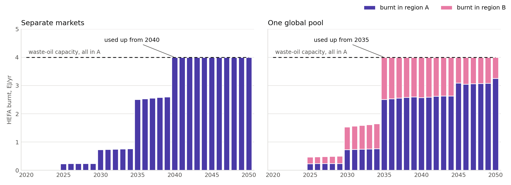
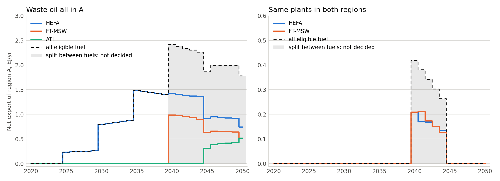

# Step 1 — fuel clearing: what works, what was measured, where this departs from the brief

Branch `feat/fuel-clearing-step1`, off the rebased spike
(`spike/unified-mda-global-discipline` on `optimisation/refueleu-migration-and-mda-dedup`).

Companion documents: [`INVENTORY.md`](INVENTORY.md) answers §2.3 and carries the
detail behind most of what follows.
For colleagues, a slide-by-slide overview of where the spike stands and the step-2
options (2026-09-23): https://claude.ai/artifact/BE2c5zPC2GeCceipW5F9hB — private until
shared. The flows-between-regions plumbing of §14-15, with a live example and the pool
prototype (2026-09-24, second version): https://claude.ai/artifact/KEVcxWWfBZpnxNFMFUFscT
— also private until shared.

---

## Status against §6

> **This table was audited against the brief on 2026-09-23**, once the brief itself was
> committed (`docs/fuel_market_spike/BRIEF4.md` — until then none of this report's
> references to §2.3, 3.3.a–j or decisions 4/6/9/10/11 resolved from the repository).
> Three rows were wrong. They are corrected here and the corrections named, because a
> status table that overstates is worse than no status table.

| criterion (§6 of the brief) | state |
|---|---|
| §2.1 `_setup_unified_mda` fix, with a test | **Done, in two parts.** The brief asked for three things: align the defaults, make both settings *configurable*, add a test. `a27bd252` had already aligned the defaults on this base (§1.1) — but it left them as literals at both construction sites, so the *configurable* half was open all week. Closed 2026-09-23 as `regionalisation.mda_tolerance` / `mda_max_iter`, with the test the brief asked for. §1.1 previously read "no work needed"; that was half right. |
| §2.3 `INVENTORY.md` and §2.4 reference input set | **Done** |
| §3.3 kernel, tests a–i green | **Done** — 53 kernel tests at the close of the brief, including 3.3.j timings; 61 on 2026-09-23 (the hard capacity ceiling of §11 added 8), plus 6 discipline tests |
| §4.2/§4.4 new mode operational; current mode untouched; first coupled run | **Done** — §8. Existing suite green unmodified. |
| §4.5.1 the `n` grid, table and figure | **Done with a substitution, §8.4.** The brief asks for `n` ∈ {2,4,6,8,12,16} across **two levels of capacity K**; this sweeps `n` ∈ {2,4,8,16} across **three levels of γ**. Kernel-level (§5.4) does use the brief's `n` values. The brief also asks each cell to record iterations, final residual, limit cycle and the operating-point elasticity; `coupled_grid.json` records convergence, price, traffic, CO₂ and share but not the four solver diagnostics. |
| §4.5.2 price regimes, with figure | **Done 2026-09-23 — §8.8.** This row previously read "Measurement 4.5.2 (coupled convergence) — Done — §8.3", which was **wrong**: §8.3 measures whether the coupled fixed point is reached, a genuine finding but not what §4.5.2 asks for. The brief asks for a multiplier on the obligation swept 0.5→2 with the compliance price, unmet volume, ramp-up bite, delivered price and **traffic**. That measurement did not exist until now. |

Existing suite: **305 passed** at the close of the brief, **330** on 2026-09-23, with the mode wired and shared code modified — which,
unlike a run against untouched code, is the guard-rail that actually means something.

---

## 1. What changed under the brief

The brief was written against `fix/mda-convergence-strictness` @ `b74b8e12`, which is
45 commits behind the branch this work sits on.

**1.1 §2.1's blocking fix is already done.** At `b74b8e12` line 707 the unified MDA
chain really is built with `tolerance=1e-5` and no `max_mda_iter`. On this base it is
`1e-10 / 200`, landed by `a27bd252 fix(multi-regional): apply the unified_mda settings
that 3bdbfb8c only claimed`, with its test and its CHANGELOG correction. `80fcbeda`
also took the NaN flag out of the coupling vector and the clip out of `RPKElasticity`.
So the one piece of shared-code work the week planned for does not exist, and J1 was
the inventory and the bench alone.

> ⚠️ **Half of that was wrong, and it cost a day.** `a27bd252` aligned the *defaults*.
> It did not do the brief's other request — *rendre les deux réglables*. Both stayed
> literals at the two construction sites, unreachable from a scenario. That went
> unnoticed until §8.7 needed to change the tolerance and an attempt to assign it after
> construction silently did nothing, producing a confident false negative. Closed on
> 2026-09-23 as `regionalisation.mda_tolerance` / `mda_max_iter`, defaults unchanged,
> with the test §2.1 asked for.

**1.2 §2.2's gate is half-failed.** #158 (kerosene selectivity) is merged. **#157 is
still open** against `main`. Its content is present on this branch line and has since
been extended, so this is a procedural blocker, not a capability gap — flagged, not
treated as a stop, on the decision to branch from the rebased spike.

**1.3 `cvxpy` was not a dependency**, and neither was a parquet engine. Both went into
the **test group**, not core and not an extra: the mode is opt-in, and the default
mode must not make every AeroMAPS install carry a convex solver. The kernel imports
cvxpy lazily with an install hint. This needs revisiting when the mode ships.

---

## 2. The finding that changes what step 1 can claim

**The optimisation mode's ramp-up cannot be reproduced by a convex program.**

There is no ramp-up constraint in the core library at all —
`aeromaps/models/optimisation/constraints/energy_constraint.py` is commented out top
to bottom. The live one is per publication, `constraints_rte.py:130`, paper Eq. (12):

```
E_t  ≤  max{ E_{t-1}·(1+τ)^dt ,  E_{t-1} + dE·dt }
```

on volumes in MJ, at 5-year enforcement years. `q ≤ max(affine, affine)` describes a
**union of two convex sets**. It is not a tolerance problem; the feasible set is the
wrong shape. This is the trap `saf_market_skeleton.py` flags in D2(b) and that
`test_rampup.py` exists to demonstrate — the brief supplied both files, and the
collision with its own §3.1 input table went unnoticed.

The brief's `"relative"` form is the convex outer relaxation of Eq. 12:
`seed + (1+g)q_{t-1} ≥ max{(1+τ)q_{t-1}, q_{t-1}+dE·dt}` when `seed ≈ dE·dt, g ≈ τ`.
So the market is **strictly more permissive** than the optimisation's ramp-up, by the
smaller branch, and the two modes differ again in annual versus enforcement-year
enforcement.

Both forms are implemented; `"relative"` is the default. The gap is a quantified
divergence to report, not something to resolve silently. It does not affect test
3.3.c, which runs with the ramp-up deliberately loose.

---

## 2b. The two regions do not interact, and a phantom price that came out of asking why

**Where the regional difference comes from.** Nothing in the brief specifies it. The
bench is inherited from the spike scenario, where the two regions differ in exactly one
input: traffic growth, 3.0 %/yr against 4.5 %/yr (`markets.yaml`, five CAGR values).
`parameters.json` is byte-identical and both regions read the same carriers file, so
they get the *same* obligation in percent. Volumes then differ only through demand,
and exactly so — the region-B/region-A volume ratio equals the demand ratio to four
decimals in every year (1.0906 in 2030, 1.2603 in 2040, 1.4563 in 2050).

**At step 1 the market is global in plumbing, not in economics.** Every constraint is
per region — the energy balance, the mandate, the ramp-up, the capacity — and the
objective is a plain sum over regions. Nothing couples them. Verified: solving both
regions in one call and solving them one at a time agree to solver noise
(volumes 1.9e-9, energy price 9.6e-10, `market_mfsp` exactly 0).

That is correct per the brief, which puts inter-regional flows out of scope, but it is
worth stating: the global-discipline machinery from the spike is justified by what
comes *later* (shared feedstock, trade, book-and-claim), not by anything step 1 does.
Today a per-region discipline would give identical numbers.

### 2b.1 A phantom compliance price, found by asking the above

The decomposition check initially disagreed on the compliance price by 8e-3 relative.
The cause was not coupling. Where the obligation is zero, the mandate constraint reads
`Σ q_s + x ≥ 0`, which the variable bounds already guarantee — **redundant**, so the
KKT system is degenerate and the solver may hang the multiplier on the mandate rather
than on the non-negativity bounds.

Measured on the bench, region A, in years with **no obligation at all**:

| year | 2020 | 2021 | 2022 | 2023 | 2024 |
|---|---|---|---|---|---|
| obligation | 0 % | 0 % | 0 % | 0 % | 0 % |
| compliance price, before | **0.01118** | 0.00769 | 0.00212 | 0.00556 | 0.0 |

0.0112 EUR/MJ is about the entire cost of kerosene. Not harmless: `marginal_price =
λ_E + λ_M`, so it inflated `market_mfsp` at any `w > 0`, and it made the dual depend
on how many regions were solved at once.

Fixed by zeroing the compliance price wherever the obligation is zero — complying with
nothing costs nothing, and a dual solution with `λ_M = 0` always exists when the
constraint is redundant, so this restores the meaningful KKT value rather than
overriding the solver. Regression test added. Afterwards the joint-vs-separate gap on
the compliance price falls from 8e-3 to **6.6e-7**.

---

## 3. The bench

Two regions differing only in traffic growth (3.0 % and 4.5 % CAGR), `unified_mda`,
two drop-in pathways — `hefa_fog` (sustainable) and `fossil_kerosene` (the residual
default) — shares fixed, top-down cost throughout. No hydrogen or electric pathway,
which side-steps the multi-type question for step 1.

**Departure from §2.4, deliberate:** `hefa_fog`'s mandate is **ReFuelEU Aviation's
obligation as a step** (2 % 2025, 6 % 2030, 20 % 2035, 34 % 2040, 42 % 2045, 70 %
2050), not the share the default 13-pathway config gives it. There, its shape comes
from five other sustainable pathways competing for feedstock; lifted out alone it
peaked at 4.8 % in 2030 and collapsed to 0.17 % by 2040, so the ramp-up never bound,
the buy-out never engaged, and measurement 4.5.2 would have had nothing to sweep.

### 3.1 What the reference measures

**The energy balance closes at machine precision** — max relative gap between
`Σ_p E_p` and `energy_consumption_dropin_fuel` is 0 (region A) and 1.15e-16
(region B). That is the number the market's own closure step is entitled to; a
correction materially larger is an error, not rounding.

**`q_init` for the sustainable pathway is zero**, and the current mode records it as
`NaN` rather than `0.0`. See §4.

**The step obligation binds hard.** Year-on-year growth of sustainable volume needed
to comply, region A: ∞ (from zero) in 2025, then +202 %, +233 %, +70 %, +24 %, +66 %
at the step years, against about +1 % between them. Any plausible ramp-up is violated
at every step and slack everywhere else. **The reference allocation is therefore not
itself ramp-up-feasible**, which is why 3.3.c must run with the ramp-up loose — as the
brief already specifies, though for a different reason than it gives.

**The cost of entry is a constant.** `hefa_fog_mean_mfsp` is flat at 0.02317 EUR/MJ
across every prospective year: the top-down cost has no volume dependence and, per
BRIEF3, there is no learning anywhere in `aeromaps/`. Every price dynamic the market
produces on this bench comes from the saturation term and the duals, never from the
supply curve moving. This bounds what measurement 4.5.1 can show and should be stated
in any write-up of it.

---

## 4. Decision 9 versus §4.2's bit-identity guard

Measured on the reference, over the 20 historical years, per region:
`hefa_fog_energy_consumption` and `hefa_fog_share_dropin_fuel` are **NaN in all 20**.
The cause is the mandate share being undefined before `prospection_start_year`, so
`share/100 × demand` carries the NaN into the volume. It does not propagate —
`dropin_fuel_mean_mfsp` is finite throughout, because `EnergyCarriersMeans` fills
before it weights — and `fossil_kerosene`, as the residual, is unaffected.

Decision 9 says the market emits zeros, never NaN. §4.2 says a reference run must be
identical bit for bit. **Both cannot hold on those two columns.**

Resolution taken: decision 9 wins, and the reproduction test compares historical years
with `NaN` treated as `0.0` on the reference side. `metadata.json` names the exact
columns (`historical_nan_columns`) so the comparison stays specific instead of
widening a tolerance everywhere. §4.2's actual guard — that the *current* mode is
unchanged — is untouched, since nothing in the market mode alters `EnergyUseChoice`.

---

## 5. The kernel

`aeromaps/models/impacts/generic_energy_model/fuel_clearing/kernel.py`. A pure
function: numpy in, numpy out, no AeroMAPS import, no state. cvxpy + Clarabel, one
solve over every region, pathway and prospective year.

### 5.1 Two things the analytic case settled

**The equality's dual is negated, and only the equality's.** cvxpy forms
`L = f + λ'(Sq − D)` for `Sq == D`, so `dL/dD = −λ`: the shadow price of demand is
minus the reported dual. The mandate and ramp-up inequalities need no flip. Before the
fix the energy price came out as −0.012 against an expected +0.012 — a plausible
number with the wrong sign, which is exactly why the brief insisted this be pinned by
the analytic case rather than read off documentation.

**Dual accuracy is not the solver tolerance.** Measured on the analytic case:

| `solver_tolerance` | energy price | compliance price | volume | status |
|---|---|---|---|---|
| 1e-7 | 2.7e-6 | 2.1e-4 | 1.1e-5 | optimal |
| **1e-9** (default) | 3.9e-9 | **2.2e-5** | 1.5e-8 | optimal |
| 1e-11 | 1.4e-11 | 1.2e-7 | 2.7e-11 | optimal |
| 1e-13 | — | — | — | `optimal_inaccurate`, refused |

All figures relative. The compliance price is consistently the weakest: it sits on the
curved power cone. At the brief's suggested 1e-9 it carries about 1e-5 relative error,
which is what the test tolerances are set from. The `optimal_inaccurate` refusal works
as specified.

### 5.2 Departures from §3.1

- **`demand_init` added** (R,). `"share_increment"` compares `q_t/D_t` against
  `q_{t-1}/D_{t-1}`, which is undefined at `t = 0` without the previous year's demand.
  The brief's input table has `q_init` but no demand counterpart. Required for that
  form only, and validated.
- **`residual_pathway` added.** §3.2's exact-closure step says to recompute "the
  kerosene" as `D − Σ others`, but the kernel only knows `is_sustainable`. Inferred
  when exactly one pathway is non-sustainable, required explicitly otherwise —
  mirroring `EnergyUseChoice`, where exactly one `default` per aircraft type is
  mandatory.
- **`average_cost` promoted to an output.** §3.1 lists it only inside `rent`, but it
  is what `market_mfsp` blends at `w = 0`, so it is worth reading directly.
- **`mandate_share` is a fraction, not a percentage**, and a percentage is rejected at
  the door. AeroMAPS uses percent throughout, so the discipline converts at the
  boundary; a silent factor of 100 here would be very hard to see downstream.

### 5.3 Tests

21 tests, all green, 11 s. 3.3.a–3.3.j plus input-hygiene cases.

**A note on tolerances.** Three tests failed on first run for the same wrong reason:
absolute MJ tolerances (`atol=1.0`) on quantities of order 1e13 MJ. Clarabel at 1e-9
on a problem scaled to max-demand-equals-one leaves about 1e4 MJ of noise, so
`atol=1.0` asserts on the solver's last bit. Volume comparisons now take their floor
from `max(demand) * 1e-7`. The same error in the other direction produced a rent
assertion of `abs=1e-3` on a quantity where a 4.6e-11 price error shows up as 371 in
currency; rent is now judged against revenue.

**Test 3.3.f was rewritten after it was found to pass trivially.** With the tight
ramp-up the module uses elsewhere, the ramp-up binds before the mandate does, the
volume stops responding, the buy-out covers the entire gap and the compliance price
sits flat on the buy-out across the whole sweep. A flat curve satisfies any continuity
bound while testing nothing. It now runs in the regime where the mandate sets the
volume, and tests continuity by **refinement** rather than against a magic constant:
halving the sweep step must roughly halve the largest jump between neighbours.
Measured ratios, over 100 → 200 points:

| `n` | 2 | 8 | 16 |
|---|---|---|---|
| ratio | 0.498 | 0.497 | 0.551 |

0.5 is what a continuous function gives; a genuine step would stay near 1.

One real discontinuity was found and is excluded from that test on purpose: at a
100 % mandate, kerosene is driven out of the mix entirely, the energy balance changes
character and the price moves by a real step (7.2× the sweep step at `n = 2`). That is
a property of the market, not a defect.

### 5.4 Sensitivities, and where the formulation stops solving

`sensitivity.py` sweeps each major parameter around a baseline that binds
(`n=4`, `γ=1`, `g=0.30/yr`, `w=0`, buy-out 0.05, discount 4 %, capacity 2.5× the
obligation). Region A, 2050 delivered price:

| parameter | swept over | spread in delivered price |
|---|---|---|
| pricing weight `w` | 0 → 1 | **37.3 %** |
| stiffness `n` | 1 → 16 | **16.3 %** |
| buy-out | 0.02 → 0.30 | **8.3 %** |
| ramp-up `g` | 0.10 → 1.20 /yr | 3.8 % |
| intensity `γ` | 0 → 4 | 1.7 % |
| discount rate | 0 → 0.08 | 0.0 % |

> These numbers replace an earlier version of this table. The `(q/K)` reformulation in
> §5.4.1 changed four of the six rows: the previous run was scoring failed cells as
> missing data and, worse, was reading a suboptimal solve at the baseline itself.

`w` dominates, which is the point of decision 10 — it is a scenario lever, not a
calibration constant. The discount rate leaves the delivered price untouched.

**The buy-out is inert until it is cheap enough to be worth paying, then it caps the
fuel price too.** The obligation's own marginal cost on this bench is **0.0546 per MJ**:
set the buy-out above that and it never binds (compliance settles at 0.0546, nothing is
released), set it below and the compliance price sits exactly on it. At 0.02 the market
stops building and pays the penalty on 1.10 % of demand, and the *delivered* price falls
8.3 %. So the buy-out is not only a policy-cost cap — priced below the compliance cost it
becomes a subsidy to non-compliance that shows up in the fuel bill.

| buy-out | 0.02 | 0.03 | 0.05 | 0.10 | 0.30 |
|---|---|---|---|---|---|
| compliance price | 0.0200 | 0.0300 | 0.0500 | 0.0546 | 0.0546 |
| unmet, % of demand | 1.10 | 0.20 | 0.04 | 0.00 | 0.00 |
| delivered price | 0.01824 | 0.01990 | 0.01990 | 0.01990 | 0.01990 |

**`γ`'s 1.7 % is misleading in isolation**, and the `(γ, n)` map explains why: at
`w = 0` and `n = 4`, γ from 0 to 1 moves the delivered price only 0.01982 → 0.01990,
because `q/K ≈ 0.8` and `(q/K)^4` is already small. At `n = 1` the same γ range moves the
uplift 4 → 16 %. The two saturation parameters are not separable. γ's real effect at this
baseline is on the *compliance* price, which it moves 0.0319 → 0.0500 (+57 %) before the
buy-out caps it — scarcity of supply raises the cost of the obligation well before it
raises the average fuel bill.

**Capacity sized on the obligation is undersized once the market anticipates.** With
1.25× headroom and a binding ramp-up, pre-building pushes `q/K` to **2.01** between
steps — the market builds twice the plant the obligation asks for, because with perfect
foresight the cheapest way to meet a step is to be ready before it. Saturation
disciplines this: at `γ = 1` the peak falls to **1.30**, and the cost of running past
capacity is what stops it going further.

The sweeps run at 2.5× headroom, which was originally chosen because 1.25× would not
clear. After §5.4.1 that is no longer the reason — 1.25× clears at both `γ = 0` and
`γ = 1` — so the headroom is now just a choice to keep the sweeps away from the
saturation term's stiff region, not a constraint imposed by the solver.

### 5.4.1 The saturation term had to be rewritten before any of this could be measured

The first version of this section reported that **half the `(γ, n)` grid did not solve**
— 18 of 36 cells, at every tolerance from 1e-9 to 1e-5 — and concluded that the brief's
measurement 4.5.1 grid (`n ∈ {2,4,6,8,12,16}`) was unreachable. That was right about the
symptom and wrong to treat it as a property of the model. It was a formulation defect.

The saturation cost was built as `a · q^(n+1)` with `a = c·γ / ((n+1)·K^n)`. Algebraically
correct, numerically unusable: `a` carries `K^-n`, and the smallest scaled capacity on
the bench is 6e-3, so the objective coefficients span **4 orders of magnitude at `n = 2`
and 35 at `n = 16`**, multiplying a power variable of the reciprocal size. The existing
scaling normalised energy and cost but not the ratio the term actually depends on.

Written instead in the utilisation it is a function of,

```
∫₀^q c(1 + γ(s/K)^n) ds  =  c·q  +  [c·γ·K/(n+1)] · (q/K)^(n+1)
```

the argument is order 1 wherever the term matters and the weight stays the size of a
cost. Same maths, different conditioning. The cones are also now built only on the
entries that actually saturate, about a quarter of the array on the bench.

| | before | after |
|---|---|---|
| `(γ, n)` cells that clear | 18 / 36 | **36 / 36** |
| agreement where both cleared, well-conditioned cells | — | 1.4e-7 relative |

**And where the old form did solve at `n = 4`, it was wrong.** Scored against the true
objective computed in numpy, the new solutions are *cheaper at equal feasibility*
(6.6505e12 vs 6.6593e12 at the baseline, violations ≤ 1e-11 of demand either way): the
old form was converging to a suboptimal point 0.13 % more expensive. Prices are duals, so
that showed up as a **3.4 % error in the delivered price** — at `γ = 1, n = 4`, which is
the baseline the whole sensitivity table is built on. This is why the table above
replaces the earlier one rather than extending it.

The lesson generalises past this term: a convex program that *solves* is not a program
that is *right*, and the only thing that caught this was scoring the returned point
against the objective independently of the solver.

### 5.4.2 At a 100 % obligation the price split is not determined

Found while checking that the continuity figure's largest jump shrank under refinement.
At `n = 16` it halved when the step halved — steep but continuous. At `n = 2`, the
*softest* case, it did not shrink at all (×0.97, ×0.98 over two refinements), which is
the signature of a genuine discontinuity.

It sits at the sweep's endpoint, where the mandate reaches exactly 100 % and the
conventional pathway leaves the basis. The obligation then forces kerosene to zero rather
than cost doing it, so `Σq_s + x ≥ D` and `Σq = D` have the same active rows and **only
the sum of the two duals is determined** — the split slides freely along it:

| mandate | 99.0 % | 99.5 % | 99.8 % | 100 % | 100 % (×2.05) | 100 % (×2.1) |
|---|---|---|---|---|---|---|
| energy price | 0.01200 | 0.01200 | 0.01200 | **−0.02616** | **−0.02054** | **−0.02070** |
| compliance price | 0.20018 | 0.20208 | 0.20327 | 0.24216 | 0.23654 | 0.23670 |
| **sum** | 0.21218 | 0.21408 | 0.21527 | 0.21600 | 0.21600 | 0.21600 |

The last three columns are the *same problem* — the share clips to 1 — and the solver
split it three different ways, including a negative energy price. The sum is smooth
throughout.

This is not a corner case for AeroMAPS: a 100 % sustainable 2050 is an ordinary scenario,
and it would have reported a negative energy price and a meaningless compliance price to
anyone reading them. The split is now pinned at the limit approached from below — while a
conventional pathway exists, the energy price is its marginal cost and the remainder is
compliance; where the obligation excludes nothing, `λ_M = 0`, as for a zero obligation
(§2b). The sum is preserved bit-for-bit, so `marginal_price`, `market_mfsp` and `rent` are
untouched, and `diagnostics["full_mandate_cells"]` counts where it was applied.

Afterwards both stiffnesses converge first-order — max jump ×0.499 at `n = 2` and ×0.501
at `n = 16` when the sweep step halves — so the dual is Lipschitz in the mandate and the
figure's claim that it "rises smoothly" is now literally true rather than nearly true.

Together with §2b this is the same defect twice, at the two ends of the mandate range: a
constraint that stops being independent makes its multiplier arbitrary. Worth assuming
that any *other* constraint in this program can do the same — the ramp-up at `g → ∞` and
the capacity at `γ → 0` are the obvious candidates, and neither is tested yet.

### 5.5 Measured timings (3.3.j)

| case | solve |
|---|---|
| 2 regions × 2 pathways × 31 years (the bench) | 0.030 s |
| 9 regions × 10 pathways × 35 years (synthetic) | 0.51 s |

At 0.03 s per solve, a 200-iteration MDA spends about 6 s in the market. The 9×10×35
case at 0.5 s per solve would be 100 s per MDA, which is usable but not free — worth
knowing before the regional extension.

### 5.6 Figures

Regenerate all three with `poetry run python -m fuel_clearing_step1.figures`.

**`figures/reproduction.png`** — test 3.3.c drawn on the real bench. The market lands
on the reference allocation in both regions; the residual stays below **1e-8 of
drop-in demand** everywhere, an order of magnitude under the solver noise floor.

**`figures/rampup_regimes.png`** — a plausible ramp-up against the ReFuelEU steps, at
`g ∈ {15, 30, 60, 120} %/yr`. This is the most informative result so far, and it
confirms the behaviour §3.2 predicted:

**Perfect foresight builds ahead of the obligation.** At `g = 15 %/yr`, region A:

| year | 2029 | 2033 | 2034 | 2035 | 2039 | 2044 | 2049 |
|---|---|---|---|---|---|---|---|
| obligation | 2 % | 6 % | 6 % | 20 % | 20 % | 34 % | 42 % |
| built | **4.5 %** | **11.7 %** | **14.1 %** | 17.1 % | **28.9 %** | **36.0 %** | **59.9 %** |

The market holds more than it owes in every year between steps, because the ramp-up
cannot take it from 6 % to 20 % in the year the step arrives. Sustainable fuel is more
expensive here and discounting penalises early spend, so it builds the minimum needed
and no more. This is a result, not a bug — and it is exactly why a ramp-up checked
*after* the fact has no purchase in this mode (decision 3).

**The buy-out is needed once**, at the 2035 step and only at `g = 15 %/yr`: 2.94 % of
demand, where 17.1 % was built against 20 % required. The compliance price is **zero**
in every year where the market is ahead (the mandate is slack), positive where it
binds exactly, and pinned to the buy-out at 0.05 EUR/MJ in 2035.

**`figures/pricing_vs_current.png`** — the market's delivered price against the current
mode's `{at}_mean_mfsp`, which is the quantity that reaches the DOC, the airfare and
therefore the demand loop. The allocation is held fixed across all curves, so every
difference is the **pricing rule** and not a different set of volumes.

Two results:

**The bridge holds exactly.** At `w = 0` with saturation off, the market's delivered
price equals the current mode's to **6.9e-9** relative, across both regions and every
year. That is decision 10's claim, verified on the real chain's numbers rather than
asserted.

**`w` is inert only when nothing is scarce.** With `γ = 0` **and the ramp-up slack**,
`w = 0` and `w = 1` give the same delivered price to **1.1e-8** — not merely close,
the same number. With a flat marginal cost and no binding constraint, `λ_E = c_k` and
`λ_M = c_s − c_k`, so the sustainable pathway's marginal price is exactly `c_s`, which
is also its average cost, and decision 10's blend has two identical endpoints.

⚠️ **An earlier version of this section said "inert unless the saturation term is
active", which is wrong.** Scarcity from the *ramp-up* does the same job. Measured at
`γ = 0`, varying only the ramp-up limit:

| `g` per year | 0.10 | 0.20 | 0.30 | 0.60 | 1.20 | loose |
|---|---|---|---|---|---|---|
| `w=1` vs `w=0` | **+137 %** | +64 % | +32 % | +26 % | 8e-11 | 4e-11 |

When the ramp-up binds, the mandate cannot be met by building more now, so `λ_M` rises
above `c_s − c_k` toward the buy-out, the marginal price leaves the average cost, and
`w` becomes live with no saturation at all.

The correct statement is: **`w` is live wherever there is scarcity rent, from either
source.** For measurement 4.5.1 this still means `n` and `w` are not independent axes,
but the inert region is smaller than "γ = 0" — it is "nothing binds".

With saturation on (`γ = 1`, `n = 4`, capacity tracking the build-out at 1.25×), region A:

| | 2025 | 2030 | 2035 | 2040 | 2045 | 2050 |
|---|---|---|---|---|---|---|
| `w = 0` uplift | +0.3 % | +0.9 % | +2.6 % | +4.0 % | +4.8 % | +6.7 % |
| `w = 1` uplift | +1.4 % | +4.3 % | +13.1 % | +20.2 % | +23.8 % | +33.5 % |

The first row is the saturation markup — a cost the current mode has no concept of.
The second adds the inframarginal rent that marginal pricing passes to the consumer.
A 33 % difference in the price that drives the demand loop is not a detail, and it is
the reason `w` is a scenario lever rather than a calibration constant.

**`figures/sensitivity_oat.png`** and **`figures/saturation_map.png`** — §5.4.

**`figures/price_continuity.png`** — the compliance price against a mandate multiplier
at `n ∈ {2, 4, 8, 16}`, beside the unmet obligation. The curves steepen with `n` and
all pass through a common point where `q/K = 1`, since `(q/K)^n` is 1 there for every
`n`. A hard capacity cap is the `n → ∞` limit of that family, which is what decision 5
rejected.

---

## 6. Decision 6 is "top-down **for now**", and the guard should say why

The brief's ground for excluding bottom-up is "the bottom-up model reads volumes:
a volume → price → volume loop". That is true but it is not the real obstacle, and
taking it as the reason would point future work in the wrong direction.

**A loop is not the problem.** AeroMAPS closes loops for a living, and the kernel
already carries a volume-dependent cost *inside* the program: the saturation term
`c(1 + γ(q/K)^n)` is a marginal cost rising with quantity, and its integral is convex.
Volume-dependent cost is fine. What matters is the *direction*.

**What bottom-up actually does with volume** (`bottom_up/cost.py:245-288`): the mean
MFSP is a vintage-weighted average, `share_v = needed_capacity_v / (consumption +
unused)`, with each vintage's cost driven by `eis_capex` read off its EIS year. Per
BRIEF3 and confirmed here by grep, **there is no learning anywhere in `aeromaps/`** —
no capacity → cost feedback at all. So the dependence is a *mix effect*, not a supply
curve.

**And a mix effect runs the wrong way.** Where `eis_capex` declines with EIS year — the
usual scenario assumption — growing faster raises the share of cheaper new vintages, so
**average cost falls as volume rises**. A decreasing average cost makes the cost
integral concave, the program non-convex, and the duals stop being prices. That is the
thing iteration cannot fix, and it is what the guard is really protecting. (In the one
committed bottom-up config, `tested_configs/data/energy_carriers_data.yaml`, `eis_capex`
is flat, so the effect is absent there — but the structure admits a declining series and
real scenarios use them.)

Two routes when it is wanted, both real:

1. **MDA around the solve, not inside it.** Freeze `c` per iteration, keep the kernel
   convex, let Gauss-Seidel close volume → cost → volume. Cheap to build. The costs are
   specific: the answer becomes a fixed point that can depend on the starting point,
   which is exactly what decision 2 bought by using a solver; the duals become
   multipliers of a program whose own parameters are outputs, so they stop measuring
   the marginal cost of the system; and it adds a feedback to the SCC that the spike
   already measured a convexity ceiling on.
2. **Put the vintages in the program.** Make capacity a decision variable with its own
   annuity, so the vintage structure is explicit and the cost stays convex. This is
   what `saf_market_skeleton.py`'s D1/D2 already describe, and it is decision 4
   reopened — it needs a capex that is not *already* inside the cost, which is exactly
   why step 1 froze `K` against a top-down full cost.

This is structurally the same problem as the skeleton's NOTE-WACC: "une MDA autour du
solve, pas un solve unique". Route 2 is the principled one.

**Action:** the guard stays, but its message should name the concavity, not the loop,
so whoever hits it knows which of the two routes they are choosing between. Written up
here rather than implemented, since the guard itself lands with J4.

---

## 8. J4: the market inside the MDA

`FuelClearing` is a **global**, non-namespaced discipline. It reads every region's
drop-in demand and pathway costs in one call and clears them in one convex program.
`EnergyUseChoice` is not instantiated in this mode — the market decides the volumes
rather than allocating them against a fixed share — and emits the same nine output
families under the same names, from the shared `derive_share_families()` rather than a
second copy of that arithmetic.

### 8.1 Which price goes where, and why net is not the same as gross

The market **decides on net cost and reports on gross**, and both halves matter.

It decides on `{p}_net_mfsp` because that is what determines which pathway is marginal.
Measured on the bench, whose carbon tax is 5 EUR/t — not zero, which was itself a
surprise:

| 2050, region A | `mean_mfsp` | `net_mfsp` | carbon tax |
|---|---|---|---|
| hefa_fog | 0.023170 | 0.023273 | 0.000103 |
| fossil_kerosene | 0.012000 | 0.012443 | 0.000443 |

Kerosene is taxed 4.3× harder per MJ (88.6 vs 20.6 gCO₂/MJ), so the premium the mandate
has to bridge is 0.011170 gross but **0.010830 net, 3 % smaller**. Extrapolating those
factors, the premium reaches zero near **164 EUR/tCO₂**: above that the ordering
reverses, the mandate stops binding and the market buys sustainable fuel unprompted. A
market clearing on gross MFSP could never produce that result.

It reports on the gross basis because `DirectOperatingCosts` adds the carbon tax as its
**own line** on top of the fuel line. Publishing a net-basis price into `mean_mfsp`
would count the tax twice. So:

```
market_mfsp_p = (1−w)·average_cost_p + w·marginal_price_p − (net_mfsp_p − mean_mfsp_p)
```

Every existing reporting line keeps its meaning, including the carbon-tax component
shown separately. At `w = 0` with no scarcity, `average_cost_p = net_mfsp_p` and the
expression collapses to `mean_mfsp_p` exactly — which is what makes §8.2 possible.

**A passenger-level tax is deliberately NOT in the objective.** It is uniform across
fuels, so it cannot change which pathway is marginal; including it would be wrong, not
conservative. It still reaches the market, through demand — airfare, elasticity, fuel
demand, clearing — which is the loop the MDA closes anyway.

**`{p}_market_mfsp` has no existing equivalent.** Two things in AeroMAPS are called
marginal and neither does this job. `{p}_marginal_mfsp` exists only in the bottom-up
cost model (out of scope per decision 6) and means the newest vintage's cost.
`{type}_marginal_net_mfsp` is `max_p net_mfsp_p` and is **consumed by nothing** — BRIEF2
§6 already flagged it. A maximum over pathway costs is capped by the dearest pathway; a
shadow price is not. On the bench the market's marginal price reaches 0.06698 in 2035,
**2.89× the dearest pathway**, and 0.03388 in 2050 (×1.46). The gap is the scarcity
rent, and it is the quantity this whole mode exists to produce.

### 8.2 The reproduction test, end to end

With nothing scarce (`γ = 0`, loose ramp-up, buy-out far above any cost, `w = 0`) the
mode must reproduce the current mode. It does — and not only in the volumes, which is
all test 3.3.c could check:

| 2050, both regions | reference | market | worst relative, all years |
|---|---|---|---|
| `hefa_fog_energy_consumption` | 9.84171e12 | 9.84171e12 | 1.1e-09 |
| `fossil_kerosene_energy_consumption` | 4.21788e12 | 4.21788e12 | 8.2e-10 |
| `hefa_fog_share_dropin_fuel` | 70 | 70 | 1.9e-09 |
| `dropin_fuel_mean_mfsp` | 0.019819 | 0.019819 | 1.8e-10 |
| `dropin_fuel_mean_co2_emission_factor` | 41.1 | 41.1 | 1.0e-09 |
| `co2_emissions_passenger` | 493.04 | 493.04 | 6.3e-10 |
| `airfare_per_rpk` | 0.0867286 | 0.0867286 | 5.1e-11 |
| `rpk` | 1.98233e13 | 1.98233e13 | 1.6e-11 |

**Worst relative difference across every variable and year: 1.9e-09.**

An independent confirmation fell out of it: the no-scarcity compliance price came back
at **0.01083**, which is the *net*-basis premium measured in §8.1 (0.010830) and not the
gross one (0.011170). The decide-on-net rule is doing what it says.

### 8.3 Measurement 4.5.2 — the coupled fixed point

Turn scarcity on (ramp-up 20 %/yr, capacity 1.1e13, `γ = 1`, `n = 4`) and the market
reaches the traffic loop:

| | no scarcity | scarce, `w = 0` | scarce, `w = 1` |
|---|---|---|---|
| delivered price 2050 | 0.019819 | 0.021839 (+10.2 %) | 0.04020 (**+103 %**) |
| max compliance price | 0.01083 | 0.047886 | — |
| RPK 2050 | 1.98233e13 | −1.2 % | **−10.8 %** |
| CO₂ 2050 | 493.04 | −1.2 % | — |

**At `w = 1` the loop does not converge under the default solver.** AeroMAPS builds the
unified chain with `MDAGaussSeidel`, `over_relaxation_factor = 1.0` and
`acceleration_method = NONE`; the residual stalls at 2.1e-1 after 200 iterations, in
`ask` and `rpk` — the traffic loop, not the market.

| inner MDA setting, at `γ = 1, n = 4` | residual |
|---|---|
| undamped (the default) | 2.1e-1 — stalls |
| `over_relaxation_factor` 0.7 | 3.9e-8 |
| `over_relaxation_factor` 0.5 | 1.3e-6 — *worse*, over-damped |
| **Secant** | **converged** |
| **Alternate-2-delta** | **converged** |

> ⚠️ **An earlier version of this section stopped here and concluded "acceleration
> fixes it". That is wrong and the coupled grid disproves it.** Acceleration fixes
> *this cell*. Across the 4.5.1 grid with Secant on throughout, all 12 `w = 0` cells
> converge and only **3 of 12** `w = 1` cells do (§8.4). Acceleration is necessary,
> not sufficient.

### 8.3.1 What actually fails, measured

Instrumenting the market's outputs per MDA iteration locates it precisely. Everything
is converged to 1e-12 except **two years**, where:

| year | compliance-price spread | SAF-volume spread | demand spread |
|---|---|---|---|
| 2027–2039, 2048–2049 | 3.6e-5 | ~1e-12 | ~1e-13 |
| **2044** | **1.000** | 8.9e-3 | 2.0e-2 |
| **2045** | **0.426** | 2.0e-2 | 2.0e-2 |

**The dual swings 100 % of its own magnitude while the primal moves 1–2 %.** That is
not a gain problem — measured loop gain is ≈ 0.32, far below 1, and a gain that low
cannot diverge. It is a *discontinuity*: a 2 % demand wobble flips the mandate
constraint between binding and slack, and λ_M jumps between a positive value and zero
when it does. The volumes barely notice; the multiplier is a step function across that
boundary. The iterate settles into an exact period-3 limit cycle.

**This is why `w` matters, and it is not "the price is more volatile".** At `w = 0` the
delivered price is the average cost — a function of the *volumes*, which move 1 %. The
jump never reaches the traffic loop and the MDA converges in 40 iterations. At `w = 1`
the delivered price contains λ_M, so a discontinuous quantity is fed to the airfare.
**`w` is the switch that decides whether the model couples to something that is a
well-defined function of the state.** Volumes are; duals at an active-set boundary are
not.

This is the same defect family as §2b (a dual where the constraint is redundant) and
§5.4.2 (a dual split where two constraints coincide). Those two were static wrong
numbers. This one is dynamic, and it is the one that stops the solver.

### 8.3.2 A hypothesis, tested and rejected

2045 is a ReFuelEU step year, so the obvious explanation was that the **staircase**
obligation puts the market on a constraint boundary. Tested by re-running the same
case with the mandate interpolated `linear` between the same points instead of
`previous`:

| obligation | outcome |
|---|---|
| staircase, as the regulation reads | failed, residual 4.50e-2 |
| smoothed, same points, linear | failed, residual 2.87e-2 |

**Rejected.** Smoothing the policy moves the boundary rather than removing it: with a
binding ramp-up there is still a year where it stops binding, whatever shape the
obligation has. So this is not a property of ReFuelEU's staircase — it is intrinsic to
coupling an MDA fixed point to the duals of a constrained intertemporal program.

What remains unexplained is *which* cells survive: across the grid, `w = 1` converges
at (γ=1, n=4), (γ=2, n=2) and (γ=2, n=4), and fails at all four `γ = 0.5` cells and at
every `n ≥ 8`. Stronger saturation regularises the program — it is the term that makes
the cost strictly convex in volume — so more of it should mean better-behaved duals,
and `n ≥ 8` means a *weaker* markup here because `q/K < 1`. That ordering is
suggestive but it does not fit cleanly (γ=1, n=2 fails while γ=2, n=2 converges), so
it is recorded as an observation rather than a mechanism.

> ⚠️ **This section's conclusion has been superseded by §8.6.** What was "suggestive
> but does not fit cleanly" above was the last reading taken *before* the active set
> itself was instrumented. Once it was, the mechanism turned out to be specific and
> checkable, and `w > 0` became a dial. The section is kept because the rejected
> hypothesis is still a correct rejection, and because the shape of the mistake — a
> pattern read off which cells happened to survive — is worth leaving visible.

### 8.4 Measurement 4.5.1, coupled

`coupled_grid.py` sweeps the saturation pair through the **full MDA**, so unlike the
kernel-level map in §5.4 the volumes are free to respond: a higher price cuts demand,
which cuts the volume, which relieves the scarcity that raised the price. **Plain
Gauss-Seidel, no acceleration**, with the demand-anchored balance of §8.6 (`eta = 0.5`)
throughout. Delivered price % / RPK % against the no-scarcity run, region A 2050:

| | n=2 | n=4 | n=8 | n=16 |
|---|---|---|---|---|
| **w=0**, γ=0.5 | +10.7 / −1.3 | +5.2 / −0.6 | +1.8 / −0.2 | +0.4 / −0.0 |
| **w=0**, γ=1 | +21.0 / −2.4 | +10.1 / −1.2 | +3.6 / −0.4 | +0.8 / −0.1 |
| **w=0**, γ=2 | +40.5 / −4.6 | +19.5 / −2.2 | +7.1 / −0.8 | +1.6 / −0.2 |
| **w=1**, γ=0.5 | +113.4 / −11.8 | +91.0 / −9.7 | +73.5 / −8.0 | +64.4 / −7.1 |
| **w=1**, γ=1 | +138.8 / −14.1 | +115.4 / −12.0 | +83.6 / −9.0 | +66.9 / −7.3 |
| **w=1**, γ=2 | +183.8 / −17.8 | +138.8 / −14.1 | +100.5 / −10.6 | +71.4 / −7.8 |

**24 of 24 cells converge**, against 15 of 24 before §8.6. Both rows are monotone in `n`
and in `γ`; the irregular pattern §8.3.2 tried and failed to explain was never a pattern,
only a trend read off whichever cells happened to survive.

Getting the last three took a second diagnosis, and it is not the same one — see §8.7.

**The anchored run agrees with the rigid one wherever the rigid one worked.** This is
the system-level version of the inertness argument in §8.6, and it is worth more than
the kernel test because it exercises every discipline between the market and demand:

| | cells | agreement |
|---|---|---|
| `w = 0` (including the reference) | 13 | ~1e-10 relative — unchanged, as required |
| `w = 1`, converged under both | 3 | ≤ 3.9e-8 relative |
| `w = 1`, previously failing | 6 | now converge |

The demand slope changed nothing that already worked and fixed what did not. Note also
that the `w = 1` row is now monotone in `n`, the same shape as `w = 0` — the pattern
§8.3.2 could not find was an artefact of reading a trend off whichever cells happened
to survive.

Two results survive the feedback loop intact:

**The kernel-level ordering holds.** The uplift still falls monotonically in `n` at
every γ, for the same reason: the bench runs below capacity, so `(q/K)^n` shrinks as
`n` rises and a stiffer squeeze is a *smaller* markup until the limit is actually
reached. The coupled magnitudes are close to the kernel-level ones, so the demand
response damps the price effect only slightly at `w = 0`.

**The traffic response is roughly a tenth of the price response,** consistently:
+42.1 % on price gives −4.7 % on RPK, +21.9 % gives −2.5 %, +10.2 % gives −1.2 %. That
ratio is the product of the two transmissions measured in §8.3 (fuel is 13.1 % of the
airfare; demand elasticity 0.888 → 0.116), and it holds across the whole grid. So for
this bench a useful rule of thumb: **a 10 % fuel-price rise costs about 1.2 % of
traffic.**

`figures/coupled_grid.png` draws both panels. `coupled_grid.json` holds the raw cells,
including the failures, so the figure does not silently interpolate over them.

---

### 8.5 The failure, watched instead of inferred

§8.3.1 concluded that the `w = 1` failure is a discontinuous dual. That was an
*inference* from the shape of the residual, and a residual that will not fall is
consistent with several other stories — a gain above one, a badly scaled coupling, an
outright bug. §8.3.2 then tried to read a mechanism off *which cells happened to
survive*, and failed to find one that fit. Both of those are the same methodological
error the rest of this report keeps running into: reasoning about a thing instead of
instrumenting it.

So the kernel now reports it. `diagnostics["active_signature"]` is a digest of which
constraints are tight, and `active_counts` the tally per family. Both are taken from
the **primal slacks, never from the multipliers** — whether a multiplier is non-zero is
exactly the question that degenerates here, so reading the active set off the duals
would beg it.

`convergence.py` runs three MDAs on the same scarce bench and logs one line per market
solve. No acceleration in any of them.

| | market solves | converged | distinct active sets | active-set changes, 2nd half |
|---|---|---|---|---|
| `w = 0` | 23 | yes | 5 | **0** |
| `w = 1`, rigid balance | 202 | **no** (residual 8.6e-2) | 6 | **33** |
| `w = 1`, demand-anchored | 60 | yes | 6 | **0** |

The `w = 0` row is the control: if its signature also flipped, the signature would be
measuring noise rather than the active set. It does not flip once in the second half of
the run.

The two sets `w = 1` alternates between differ in **exactly two cells**:

```
{mandate tight: 31, rampup tight: 31}   <->   {mandate tight: 29, rampup tight: 33}
```

**Two (region, year) cells trade "the obligation binds" for "the ramp-up binds".** On
one side the obligation is met by volume and λ_M is the cost of substituting one fuel
for another, ≈ 0.012 /MJ. On the other the obligation has become physically unreachable
and the only way to discharge it is to pay, so λ_M snaps to the buy-out, 0.30 /MJ. The
delivered price jumps 23–29 % when it does.

**The volume is identical on both sides** — it is pinned by the ramp-up. Only the price
differs. That is not solver wander: at the crossing the value function has a real kink.
Relaxing the ramp-up saves nothing, because the obligation is already met, so the right
derivative is 0; tightening it forces a buy-out, so the left derivative is
`buyout − Δc`. The subdifferential is the whole interval `[0.012, 0.30]` — a factor of
25 — and **every point in it satisfies the KKT conditions**. There is no "correct"
value for the solver to have returned.

`test_the_compliance_price_is_an_interval_where_the_two_limits_meet` builds this as a
two-year analytic case where the ramp-up allows *exactly* the obligation, so the
interval is known in closed form.

### 8.6 The fix: quantity from supply, price from demand

The diagnosis dictates the remedy, and the remedy is not a numerical one.

Where the supply curve is vertical the quantity is determined and the price is not.
That is the ordinary situation in any capacity-constrained market, and every such market
resolves it the same way: **the quantity comes from supply and the price comes from
demand.** The program was being asked for a price that the supply side does not contain.

So the balance is given a slope. Around the incoming demand `D` and the price `p0` that
demand was formed at, introduce a free `a[r,t]` and write

```
  sum_p q  =  D + a                          (energy balance)
  sum_sust q + x  >=  m * (D + a)            (obligation, on what is actually consumed)
```

adding to the objective the consumer surplus given up, to second order:

```
  sum_t d_t * [ -p0 * a  +  a^2 / (2*beta) ],     beta = eta * D / p0
```

The quadratic keeps it convex. Stationarity in `a` then reads

```
  lambda_E + m * lambda_M  =  p0 - a / beta
```

— **the delivered marginal price equals the inverse demand at the quantity served.**
The left side is what an airline faces per MJ: the energy, plus the share `m` of
obligation that MJ drags with it (§8.1). Verified to 5e-11 in
`test_the_demand_slope_picks_one_point_of_that_interval`.

On a vertical stretch of supply, `a` moves until the price sits where demand wants it.
The gap that then opens between that price and the marginal production cost is a
**scarcity rent** — what a capacity-constrained producer earns — not an error.

**This is exact, not a relaxation.** At a fixed point of the coupling loop the price the
market returns *is* the price the demand was formed at, so `p0 = lambda_E + m*lambda_M`,
hence `a = 0`, hence the elastic program reduces to the rigid one identically. The loop
converges to a solution of the **unregularised** program or it does not converge at all;
there is no fixed point at which the added term is still bending the answer. Measured:
`|a|/D = 6.5e-11` at convergence.

**And `eta` does not have to be right.** It sets how far the price moves per sweep and
nothing else. Linearising the loop gives the requirement `beta > |dD/dp| / 2`:
over-stating the demand response is safe and merely slow; under-stating it by more than
a factor of two overshoots.

| device (at `w = 1`, no acceleration) | solves | converged | final `|a|/D` | |
|---|---|---|---|---|
| none (rigid balance) | 202 | no | — | the failure |
| volume anchor alone, ρ = 0.5 | 202 | no | — | cannot help: the volume is pinned |
| `eta = 0.05` | 202 | no | 2.8e-3 | slope too small, overshoots |
| `eta = 0.2` | 202 | no | 1.5e-9 | market settled, rest of the chain had not |
| **`eta = 0.5`** | **59** | **yes** | **6.5e-11** | |
| `eta = 1.0` | 150 | yes | 2.5e-10 | over-damped |
| `eta = 3.0` | 202 | no | 2.9e-5 | over-damped past the iteration budget |

The fastest `eta` is an estimate of the chain's own elasticity of drop-in demand to the
delivered price: the iteration is fastest when the slope it is told matches the slope it
faces. §8.4 measured that transmission independently at ≈ 0.116 of the price change in
RPK, which is not the same quantity but is the same order.

**A negative result worth keeping.** Anchoring the *volumes* instead — a proximal term
`(ρ/2)·||q − q_prev||²` — does not work, and cannot, because the primal is identical on
both sides of the kink. Measured: moving the anchor ±50 % moves λ_M across 0.6 % of the
interval it is free in (`test_the_proximal_anchor_cannot_resolve_a_pinned_primal`). It
is kept as an optional, separately weighted device for degeneracies in the *primal*,
off by default. It is the reason the fix had to come from the demand side, and it took
building it to find that out.

**Two consequences for the rest of the report.** Plain Gauss-Seidel now suffices, so the
Secant acceleration is gone from `coupled_grid.py` along with the claim that it helped
(§8.3's ⚠️). And `w > 0` is a scenario dial rather than a research problem, at the cost
of one parameter that affects the route and not the destination.

---

### 8.7 The `n = 16` column was a tolerance mismatch, not a convergence failure

After §8.6 three cells still failed: the whole stiffest-saturation column at `w = 1`.
The obvious guess was that §8.6's demand slope is mis-set there, and the linearised
iteration even supports it — with `e = e0 (beta - d) / (s + beta)`, a stiff supply curve
drives `s = 1/S'` toward zero and leaves no tolerance for under-stating beta.

**That guess was wrong, and the active-set signature said so immediately.**

| `n = 16`, γ = 0.5, `w = 1` | active-set changes | tail price step | final \|a\|/D |
|---|---|---|---|
| `eta = 0.5` | **0** | 8.3e-11 | 5.8e-10 |
| `eta = 2` | 0 | 7.5e-11 | 2.6e-7 |
| `eta = 8` | 0 | 1.3e-6 | 1.2e-3 |

The market has *converged*. No flipping, the price stationary to eleven digits, the
anchor inert — and raising `eta` only makes it worse. So whatever is failing is not the
kink and not the loop gain.

Reading the residual contributors settles it: the largest are
`region_B:hefa_fog_energy_consumption` at **2.87e+04 MJ** on volumes of ~1e13 — a
relative **2.86e-9**, which is exactly the kernel's own `solver_tolerance` of 1e-9 once
scaled. The MDA was asking for **1e-10**, one decade below the precision the market can
produce.

Tightening the solver instead does not work: at `solver_tolerance` 1e-11 or 1e-12
**Clarabel refuses the stiff cone outright** and the kernel raises rather than returning
a worse answer. There is no tighter answer to be had.

So the stopping rule was the thing out of place:

| `n = 16`, γ=0.5 | MDA tolerance 1e-10 | MDA tolerance 1e-8 |
|---|---|---|
| outcome | failed, residual 2.863e-9 | **converged** |
| delivered 2050 | — | 0.032553681 |
| `n = 8` control | 0.034053429 | **0.034053429** |

The control is the point: a cell that converges either way returns a **bit-identical**
answer at the looser tolerance. This loosens the stopping rule, not the result.

**A finding about the code, not the model.** The tolerance was hard-coded at 1e-10 in
two places in `multi_regional_process.py` and could not be set from a scenario — the
`TODO` beside it said as much, and assigning it on the chain after construction silently
does nothing, which is how the first attempt at this measurement produced a false
negative. It is now `regionalisation.mda_tolerance` (with `mda_max_iter`), defaulting to
what it was, so nothing that ran before runs differently.

**The general point, and it is the third instance in this report.** A convergence
tolerance is only meaningful against the precision of the disciplines underneath it.
Coupling a conic solver into a fixed-point loop imports that solver's noise floor into
the loop's stopping rule, and the symptom — a run that reports non-convergence having
converged — is indistinguishable from a real failure unless you instrument the
discipline. §5.4.1 was a program that solved and was wrong; §8.5 was a price that had no
single value; this is a loop that had arrived and was told it had not.

### 8.8 Measurement 4.5.2 — price regimes across the obligation

**This measurement did not exist until 2026-09-23, and the status table said it did.**
The row read "Measurement 4.5.2 (coupled convergence) — Done — §8.3". §8.3 measures
whether the coupled fixed point is reached: a real finding, and not what §4.5.2 asks
for. What it asks for is a multiplier on the obligation swept 0.5 → 2 at the
inventory's ramp-up, recording the compliance price, the unmet volume, where the
ramp-up bites, the delivered price and the **traffic** — so every point is a full
two-region MDA. `price_regimes.py`, figure `figures/price_regimes.png`.

| multiplier | 2050 obligation | compliance price | bought out | delivered 2050 | RPK 2050 | eligible share 2050 |
|---|---|---|---|---|---|---|
| ×0.50 | 35 % | 0.04005 | 0 | 0.015980 | 2.0272e13 | 35.0 % |
| ×0.75 | 52.5 % | 0.05660 | 0 | 0.018374 | 1.9988e13 | 52.5 % |
| **×1.00** | **70 %** | **0.05951** | **0** | **0.021824** | **1.9590e13** | **70.0 %** |
| ×1.25 | 87.5 % | 0.07784 | 0 | 0.027277 | 1.8987e13 | 87.5 % |
| ×1.50 | 100 % (clipped) | — | — | did not converge (1.84e-7) | | |
| ×1.75 | 100 % (clipped) | 0.08831 | 0 | 0.032832 | 1.8409e13 | 100 % |
| ×2.00 | 100 % (clipped) | — | — | did not converge (1.46e-6) | | |

**The buy-out never engages.** `unmet` stays at solver noise — below 1e-9 % of demand —
at every point. At the inventory's ramp-up the obligation is reachable across the whole
range the brief asks for, right up to 100 % eligible fuel in 2050. So **the brief's
third question — how do prices behave when the obligation becomes unreachable? — is
not answered by this sweep.** It is answered by the ramp-up sweep instead (§5.6,
`rampup_regimes`), where at a 15 %/yr growth limit the buy-out does engage, exactly
once, at the 2035 step. Which instrument creates the shortfall matters: tightening the
*obligation* does not, because perfect foresight builds ahead of it; tightening the
*growth limit* does.

The first version of this figure drew the unmet volume anyway, on a 1e-9 axis, and
produced a confident-looking V shape out of rounding error. Replaced with how the
obligation is actually met, which is entirely by volume.

> ⚠️ **Withdrawn.** This section previously reported that the compliance price "rises,
> and then falls" — 0.104 at ×1.5 against 0.0883 at ×1.75 — and read it as a third
> sighting of the build-ahead mechanism. Fixing the kerosene plumbing (§8.9) moved every
> number in the table and left ×1.5 non-convergent, so the comparison no longer exists.
> The claim is withdrawn rather than re-fitted to whichever points survived: it rested on
> two adjacent cells that differed only through the 100 % clipping, which was thin
> evidence for a mechanism §10.1 and §10.2 already demonstrate on their own.

**Above ×1.43 the 2050 obligation clips at 100 %.** The base is 70 %, so every 2050
quantity — delivered price, traffic, share — stops moving beyond that point, and the
information is in the earlier years. Worth knowing before reading the right-hand panel.

**Through to traffic:** the delivered price runs from −23 % to +50 % against the
obligation as written, and traffic from +3 % to −6 %. The ratio is the ~1/8 transmission
of §8.4, again.

**×1.5 and ×2 do not converge** (residuals 1.84e-7 and 1.46e-6 against a tolerance of
1e-7, after the kerosene fix of §8.9). Unlike §8.7 this has not been diagnosed; it is recorded as the brief asks (*convergence oui ou non*) and left.

**One defect found while building it.** Scaling the obligation with `"%g"` produced
`[0, 3.5, 10.5, 35, ...]` — a mixed int/float list. GEMSEO infers the element type from
the first entry, calls the series integer-valued and rejects 3.5 at grammar validation.
The scenario data type is a trap for any script that rewrites a series: always emit a
decimal point.

---

### 8.9 A global setting that reached the wrong pathway

Found by an external review, and present in **every** coupled measurement in this report.

`_pathway_setting` resolves a per-pathway override if given, else the global value — for
every pathway, the residual included. All three coupled scripts pass `capacity` and
`saturation_intensity` at the top level, meaning them for the pathway under study. So
**kerosene was saturating too**, at ~90 % utilisation, against BRIEF4 §3.1 (`inf` pour le
kérosène).

Re-running everything with the residual exempted:

| | change |
|---|---|
| `w = 0` cells | at most −1.6 points — the delivered price there is an average cost |
| `w = 1` cells | **up to +14 points** (+99.6 → +113.4 at γ=0.5, n=2) |
| measurement 4.5.2 | lost 2 of 7 points, and its "rises then falls" finding with them |

Saturating kerosene raised λ_E but lowered λ_M by more, so it was **suppressing the very
scarcity signal the measurement exists to show**. The residual is now exempt from the
global scarcity settings and takes the no-scarcity default unless named explicitly under
`pathways:` — a fossil supply limit is legitimate, it just has to be asked for. Six tests
in `test_fuel_clearing_discipline.py`, which is also the first test of the *discipline*
rather than the kernel.

**The tolerance had to move with it.** Six `w = 0` cells that converged before now failed
at residual 2.3–3.0e-8 against the 1e-8 I had set. Same story as §8.7, and this time on
me: removing a strictly convex term costs the solver accuracy, so a tolerance tuned
against the buggy configuration was just a different arbitrary number. It is now derived
in all three scripts as ~100× the kernel's own `solver_tolerance` — 1e-7 — with the same
control as §8.7: a cell converging at both returns a bit-identical answer (0.021824076).
Grid back to **24/24**.

**And the check on the fix found a second thing.** With kerosene free, λ_E should equal
the kerosene cost. It sits 3.6 % above it — by a gap identical in every year and both
regions: **0.00044350**. That is exactly the carbon tax: 88.7 gCO₂/MJ × 5 EUR/tCO₂ =
0.00044350. So the identity holds, on the **net** basis the program decides on (§8.1) —
and `fuel_market_energy_price` is published on that net basis while `{p}_market_mfsp` is
published gross, with the wedge stripped. Two published prices, two bases, nothing saying
so; anyone differencing them finds a carbon tax they did not put there. **Recorded, not
fixed:** which basis a dual should be published on is a design decision.

---

## 9. The two open decisions, settled

### 9.1 Degeneracy candidates (was §7.5): both clean

Tested, and **neither is a defect**.

**The ramp-up dual as `g -> infinity`** never reaches exactly zero, but that was a
misreading on my part: with `q_init = 0` the first year's constraint is `q <= seed`,
which binds regardless of `g`. The *seed* controls first-year binding, not the growth
rate. Raising the seed instead drops the dual to 3e-13, as it should.

**The capacity as `gamma -> 0`** is perfectly inert — outputs identical to the last bit
across capacities from 0.1x to infinite. With `gamma = 0` the term is absent from the
objective, so there is no multiplier to be degenerate.

The useful artefact is the check rather than the result. **Complementary slackness** —
a multiplier may be non-zero only where its constraint is tight — is the single property
that all three real degeneracies violated, and nothing tested it. It is now a
parametrised test over seven regimes and all three inequality families, chosen at the
*edges* (zero obligation, full obligation, a constraint that cannot bind) because a
mid-range case sees none of them. Worst residual across the lot: **1.4e-8**, solver
noise; the phantom compliance price scored 0.46 on the same measure.

Two notes on the metric, because I got it wrong twice before it was right. Testing
"slack wherever lambda exceeds a threshold" reports the slack of any year whose dual
carries noise — it measures the noise floor, not the model. Normalising the product by
`max(lambda)` blows up exactly in the slack case the check exists for, since the
denominator goes to zero. The stable form is `lambda * slack/demand` against the cost
scale.

### 9.2 Ramp-up form for the headline comparison: `relative`

Measured on the bench, the two forms differ in ways that decide the question.

| | `relative` | `share_increment` |
|---|---|---|
| excess over paper Eq. 12 | **0.73 %**, independent of `g` | 5.5 % at `g=0.10` → 13.0 % at `g=0.30` |
| compliance price vs seed (0.001 → 1.0) | 0.05000 → 0.01176 (**4.3x**) | 0.01176 throughout |
| free parameters | `g`, `seed` | `g` |

`share_increment` looks better on robustness — it has no seed — but it is a much looser
relaxation of Eq. 12, and the looseness *grows with `g`*, so a comparison against the
optimisation mode would be confounded by the very parameter being swept.

**And the seed is not a free parameter.** In the Eq. 12 correspondence it *is* that
constraint's volume branch, `dE*dt`. The published calibration is
`volume_ramp_up_constraint_biofuel = 0.2 EJ/yr` at an ASK share of 0.1549 — about
**1.5 % of annual demand**. So the 4.3x sensitivity is not arbitrariness; it is Eq. 12's
second branch doing real work, and the honest fix is to derive the seed rather than pick
it. `0.005` as used in the sweeps is roughly 3x tighter than the published calibration.

**Decision: the headline comparison uses `relative`, with the seed derived from `dE`.**
That gives a relaxation 0.73 % looser than Eq. 12 with no free parameters beyond the two
the optimisation mode itself has.

`share_increment` stays, as the **policy-facing** form: "the sustainable share may rise
by at most `g` points per year" is how an obligation is usually argued about, and it
needs no seed. It must be labelled as *not* comparable to the optimisation mode, because
its gap to Eq. 12 depends on `g`.

The defaults stay "no ramp-up" (`g = 1e3`, seed = 1.0x demand) so the mode still
reproduces the current one out of the box; 1.5 % is the calibrated value for when the
ramp-up is switched on, documented at `DEFAULT_SETTINGS`.

---

## 10. Policy cases: five fuels, regional eligibility, sub-mandates, a carbon tax

`policy_cases.py`. Two fuels and identical policy in both regions tests the machinery
and nothing else — with one sustainable pathway the market has no choice to make, only
a quantity to set. These cases are the smallest setting in which it behaves like a
market. Run at the kernel level: the traffic loop changes no ordering
(§8.4) and changes no ordering at `w = 0`, while an MDA per cell would cost minutes and
put §8.3's convergence problem between the reader and the policy question.

Five pathways — kerosene, HEFA from waste oil, HEFA from crop oil, alcohol-to-jet,
e-fuel — with costs and capacities in the usual ordering. **The conclusions below are
about orderings and mechanisms, not about the numbers**, which are illustrative.

### 10.1 Eligibility is policy, not chemistry

`is_sustainable` now accepts `(R, P)` as well as `(P,)`. This was not expressible
before: the guard in `_shared_pathways_manager` requires every region to declare the
same pathways, which is right for the arrays but says nothing about which of them a
region *counts*. Eligibility governs the **mandate only**; the ramp-up follows
"eligible in at least one region", because an industrial growth limit does not change
because a jurisdiction declines to count the fuel. The residual must be ineligible
everywhere, since it absorbs the balance.

The case: one ReFuelEU-like region that excludes crop feedstock, against one that
allows it, same headline obligation.

| region A, 2050 | waste oil | crop oil | ATJ | e-fuel |
|---|---|---|---|---|
| crop **excluded** | 8.7 % | — | 20.3 % | **41.0 %** |
| crop **allowed** | 9.0 % | 31.4 % | 21.2 % | **8.5 %** |

**Excluding a cheap feedstock is dearer every year except the last**: +60 % on the
compliance price in 2030, +139 % in 2040, and **−10 % in 2050**. The mechanism is the
ramp-up. Denied the cheap option, region A builds e-fuel early and arrives at 2049 with
a 30.9 % base; the permissive case coasts on crop oil and arrives with 5.0 %. When the
obligation jumps 42 % → 70 %, all four of the permissive region's pathways hit their
growth limits at once. **Cheap options early leave you worse placed for a steep step
later** — a result a share-allocation model cannot produce, because it has no notion of
what was built when.

The feedstock sweep shows the same thing from the other side: more waste oil cuts the
2040 compliance price by 60 % and leaves the 2050 price flat or higher, because every
unit of cheap feedstock displaces a unit of the pathway that scales.

**Metric warning, recorded because it inverted both results.** Reported as a *maximum
over years*, the exclusion looked cheaper and more waste oil looked dearer. Both are
true of the maximum and both hide the finding; the trajectory is the honest view.

### 10.2 Sub-mandates

ReFuelEU carries a separate synthetic-fuel target on top of the headline obligation.
`submandate_share` plus `is_submandated` express it, with their own slack and release
price. Absent by default, and when absent the program built is the one built before —
no constraint, no slack variable, no objective term. A sub-mandated pathway carries
**both** multipliers in `marginal_price`: one unit of e-fuel genuinely relaxes two
distinct constraints. Guards: a sub-mandate must be a **subset** of the mandate (a fuel
meeting the narrow obligation but not the broad one is a second unrelated policy, and
the duals would not be comparable), and cannot exceed the obligation it narrows.

With ReFuelEU's Annex I trajectory (1.2 % in 2030 to 35 % in 2048):

| | 2030 | 2040 | 2050 |
|---|---|---|---|
| e-fuel, no sub-target | 0.0 % | 5.4 % | 41.0 % |
| e-fuel, with sub-target | 1.2 % | 15.0 % | **46.2 %** |
| main compliance price | 0.01800 → 0.01721 | 0.08718 → **0.04103** | 0.09100 → **0.06908** |

By 2050 e-fuel *exceeds* the 35 % target, because the forced early build-out leaves a
bigger base to grow from. Met by building throughout; nothing released.

**The main compliance price falls in every year, and that is not a saving.** An extra
constraint on the same program can only make the optimum dearer, and it does: total
discounted production cost **+10.7 %**, fuel bill **+5.1 %**. What falls is the price of
*one instrument* because the other is now doing that work. This is the same mechanism as
§10.1 — force the scalable pathway early — but by design rather than by accident.

### 10.3 A carbon tax, and nothing else

Every obligation switched off; the only policy is a price on carbon. The kernel is
handed tax-inclusive costs, since that is what decides which pathway is marginal (§8.1),
and what the buyer pays is reported separately from what the fuel cost to make — a tax
is a transfer, not a resource cost.

| tax, EUR/t | 0–150 | 200 | 400 | **600** | 1200 |
|---|---|---|---|---|---|
| fuel intensity, gCO₂/MJ | **88.6** | 81.2 | 71.2 | **15.7** | 5.8 |
| kerosene share | **100 %** | 85 % | 67 % | **0 %** | 0 % |

**Below about 170 EUR/t a carbon tax on aviation fuel buys nothing at all.** It is pure
revenue: the mix stays 100 % kerosene and the intensity does not move. First movement is
crop oil at 200.

**Then a cliff between 400 and 600**, where kerosene goes from 67 % to zero and intensity
falls 71.2 → 15.7. That is not a numerical artefact: kerosene's tax-inclusive cost
(`0.0120 + 88.6·τ/10⁶`) crosses e-fuel's (`0.0550 + 5.0·τ/10⁶`) at **τ = 514 EUR/t**, and
the whole residual switches at once. A tax works by moving one crossing point at a time,
so its effect is a staircase, not a slope.

### 10.4 The same destination by two instruments

Bisecting for the carbon tax that reaches ReFuelEU's 2050 sustainable share:

| | production cost | fuel intensity | mix |
|---|---|---|---|
| **mandate** (70 % obligation) | 0.03427 EUR/MJ | **36.5** gCO₂/MJ | 30 % kero, 9 % waste, 20 % ATJ, 41 % e-fuel |
| **tax** at 515 EUR/t | **0.03056** EUR/MJ | 41.3 gCO₂/MJ | 30 % kero, 6 % waste, 18 % crop, 13 % ATJ, 33 % e-fuel |

Same sustainable *volume*, different outcome. The tax is **10.8 % cheaper in resource
terms** and **13 % dirtier**, because it buys the cheapest sustainable fuel rather than
the cleanest one, and crop oil at 45 gCO₂/MJ is the cheapest.

**Read that carefully: the environmental work is being done by the feedstock
restriction, not by the volume target.** A mandate expressed in volume is not an
emissions instrument; it becomes one only through its eligibility rules.

One confound, stated because it matters: the tax case has no mandate, so no eligibility
rule applies and crop oil is available to it. That is realistic — eligibility rules only
exist inside mandates — but it means the comparison is "restricted mandate" against
"unrestricted tax", not instrument against instrument at equal restriction.

### 10.5 What these cases cannot do

- **Regions do not interact.** Every constraint is per region (§2b), so there is no
  leakage: a stricter region cannot draw supply away from a looser one. That is the most
  important missing mechanism for the background objective. It is to come from a global
  pool that every region supplies and draws on — flows tracked, no routes, no transport
  costs (§12.5).
- **2050 is the horizon**, and also the steepest step, so every result turning on "what
  is built by the final step" is partly a terminal condition.
- **Region A and region B differ in traffic growth as well as eligibility** (3.0 against
  4.5 % CAGR), so the side-by-side figure mixes two causes. `cost_of_exclusion` is the
  like-for-like comparison.
- **Emission factors are assumed**, and §10.4's conclusion depends on their ordering —
  specifically on crop oil being dirtier than the alternatives it displaces.

Figures: `policy_fuel_mix.png`, `policy_exclusion_cost.png`,
`policy_feedstock_squeeze.png`, `policy_submandate.png`, `policy_carbon_tax.png`.

---

## 11. Five pathways: a supply curve that bends against one that jumps

`fuel_clearing_step1/five_pathways.py`, on `scenario/energy_carriers_five.yaml` — the
real merit order, lifted verbatim from the default carrier data:

| pathway | net cost 2050, EUR/MJ | capacity used here |
|---|---|---|
| `fossil_kerosene` | 0.01244 | residual, uncapped |
| `hefa_fog` | 0.02327 | 2.0 EJ/yr |
| `ft_msw` | 0.03234 | 2.8 EJ/yr |
| `atj` | 0.03966 | 2.8 EJ/yr |
| `electrofuel` | 0.09970 | **uncapped** — PtL is bound by electricity and capital, not by a feedstock |

### 11.1 Why the two-pathway bench could not answer this

With one sustainable pathway the obligation names the only fuel that can meet it. There
is no allocation to make, so the *shape* of the limit has nothing to express: a staircase
with one step has no step to step between. Everything in §8 was measured on that bench,
which is why the choice between the two ways of limiting a pathway went unexamined for
the whole of step 1.

### 11.2 The two configurations, and what is held fixed

Both use the same K, the same loose ramp-up, the same buy-out, the same demand anchor
(η = 0.5) and the same MDA tolerance. The only difference is what K *means*:

- **bends** — `saturation_intensity = 1`, `capacity = K`: marginal cost `c(1 + γ(q/K)^n)`,
  so the pathway may pass K at rising cost. Two stiffnesses, n = 4 and n = 16.
- **jumps** — `saturation_intensity = 0`, `capacity_limit = K`: cost flat at `c` right up
  to K, and nothing beyond it. A literal staircase.

The hard ceiling did not exist before this measurement. It is new in `kernel.py`
(`capacity_limit`, dual `capacity_price`) and in the discipline, with seven tests
including the stationarity identity and an independent objective score.

### 11.3 What it does, 2050, w = 1

| region A | λ_E | λ_M | delivered | airfare | RPK | CO₂ | eligible volume |
|---|---|---|---|---|---|---|---|
| nothing scarce | 0.01244 | 0.01083 | 0.01982 | — | — | — | 9.84 EJ |
| bends, n = 4 | 0.01244 | 0.06526 | 0.05787 | +25.5 % | −18.5 % | −0.3 % | 8.29 EJ |
| bends, n = 16 | 0.01244 | 0.08222 | 0.06974 | +33.5 % | −22.9 % | −4.6 % | 7.92 EJ |
| **jumps** | 0.01244 | **0.08725** | **0.07327** | **+35.9 %** | **−24.1 %** | −6.4 % | 7.82 EJ |

| region B | λ_E | λ_M | delivered | airfare | RPK | CO₂ | eligible volume |
|---|---|---|---|---|---|---|---|
| nothing scarce | 0.01244 | 0.01083 | 0.01982 | — | — | — | 14.33 EJ |
| bends, n = 4 | 0.01244 | 0.08725 | 0.07328 | +35.9 % | −24.1 % | −10.7 % | 11.385 EJ |
| bends, n = 16 | 0.01244 | 0.08725 | 0.07328 | +35.9 % | −24.1 % | −12.1 % | 11.385 EJ |
| jumps | 0.01244 | 0.08725 | 0.07328 | +35.9 % | −24.1 % | −12.5 % | 11.385 EJ |

Mix, 2050, w = 1, as % of drop-in fuel:

| | fossil | hefa_fog | ft_msw | atj | electrofuel |
|---|---|---|---|---|---|
| A, bends n = 4 | 30.0 | 20.9 | 25.7 | 23.4 | 0.0 |
| A, bends n = 16 | 30.0 | 19.0 | 25.8 | 25.3 | 0.0 |
| A, jumps | 30.0 | 17.9 | 25.1 | 25.1 | 2.0 |
| B, bends n = 4 | 30.0 | 16.6 | 20.7 | 19.1 | 13.7 |
| B, bends n = 16 | 30.0 | 13.3 | 18.0 | 17.7 | 21.1 |
| B, jumps | 30.0 | 12.3 | 17.2 | 17.2 | 23.3 |

Figures: `five_pathways_mix.png`, `five_pathways_effects.png`, `five_pathways_plane.png`.

### 11.4 The one structural result

**Read the two tables against each other.** In region B the three configurations give the
*same* λ_M to five decimals, the *same* delivered price, the same airfare, the same
traffic and the same eligible volume — 11.385 EJ in all three. Only the mix differs, and
with it the CO₂. In region A they differ by a quarter: λ_M 0.065 against 0.087, traffic
−18.5 % against −24.1 %.

The difference between the regions is *which pathway is on the margin*. Region B's
obligation is large enough to reach `electrofuel`, which is uncapped and unsaturated, so
it sets the price at its own cost in every configuration — and how the pathways *below*
it are limited cannot touch a price it alone determines. Region A's obligation stops
inside the capped set, so the marginal unit is a limited one and the shape of its limit
is the price.

> **The shape of a supply limit matters only where a limited pathway is marginal.**
> Where an unlimited backstop is marginal, γ and n change who earns the rent and nothing
> else — not the price, not the airfare, not the traffic.

And where it does matter, it matters in a specific direction: **soft saturation
understates scarcity**, and the understatement is the whole gap between a 65 %
compliance-price rise and an 87 % one. n = 16 recovers most of the hard answer (0.08222
against 0.08725), which is the documented n → ∞ limit arriving.

### 11.5 So: keep γ, n, K?

Keep **K**. Drop **γ and n** as the default.

The argument is not that the bent curve is wrong. It is that at n = 4 the market charges
0.065 for the marginal eligible unit — a number that is not any pathway's cost, that no
plant would quote, and that is a pure artefact of the interpolation between 0.0397
(`atj`'s cost) and 0.0997 (`electrofuel`'s). It is a price for a fuel nobody makes. The
hard cap says instead that the next unit after `atj` runs out is an `electrofuel` unit at
`electrofuel`'s cost, which is a statement an engineer can check and disagree with.

γ and n also cannot be calibrated: there is no measurement whose answer is "γ = 1, n = 4".
K can be — it is a plant fleet, in MJ/yr, against which ENSPRESO and the ReFuelEU impact
assessment have numbers.

**What the soft form was for, and whether it is still needed.** Decision 5 chose it
because a hard cap gives a step-function dual and a step-function price whipsawed the
traffic loop (§8.5). The demand anchor removed that failure at the source (§8.6), and the
hard-cap runs here converge — region A in 91 Gauss-Seidel sweeps against 44 for n = 4 and
97 for n = 16, so the staircase is **not** the slowest of the three. The reason for the
soft form has expired.

Keep γ and n available. They remain the right tool for a pathway that genuinely has a
rising cost curve rather than a wall — a feedstock drawn from a graded resource, where
the next tonne really is dearer than the last. That is a *different* physical claim from
"the plant produces 2 Mt/yr", and the model should be able to say both.

### 11.6 The price/quantity plane

`five_pathways_plane.png`, 2050, `w = 1`, two panels (redrawn 2026-09-23). The x axis is
eligible volume, the y axis what an eligible MJ is paid, λ_E + λ_M.

**Left — the supply side alone.** The same capacities K as a staircase (hard cap) and as
bent curves for (γ, n) = (1, 2), (1, 4), (1, 16), (3, 4): the aggregate inverse of
`q_p(π) = K_p((π/c_p − 1)/γ)^{1/n}`. The bends **start before K**: a fuel's cost is already
rising as it approaches K, so the next fuel becomes the cheaper one sooner — at n = 4,
`ft_msw` enters at 1.58 EJ instead of 2.0 (`(q/K)^4 = c_ft/c_hefa − 1`). And they **run
past K**, because nothing stops a soft pathway there. Higher n tends to the staircase;
higher γ bends harder and reaches the backstop sooner.

**Right — both regions' demand crossing supply.** Each region has its *own* identical
staircase (capacities are per region at step 1). The demand curves are **measured**: every
converged `w = 1` run shares AeroMAPS's traffic chain and differs only in supply, so each
one is a point `(m·D, λ_E + λ_M)` of the same demand curve for its region; the lines are a
monotone interpolation between them, nothing fitted. Four probes were added to move the
crossing along the curves (e-fuel capped at 2 and 3 EJ; every capacity ×0.8 and ×0.65); the
last two did not converge (§7, item 18), so region B's curve has five points and region A's
four. The earlier version of this figure drew the demand side as the market's own
linearisation, slope −m²β — a tangent that passes through the right point with an arbitrary
slope, and so the wrong picture of demand.

The clearing point of the hard run sits at the *foot of the `electrofuel` step*, on a flat
segment — not on a riser. That is worth saying plainly, because it bounds the whole
concern about step-function duals: **with an uncapped backstop in the set, the staircase
never leaves the price undefined.** Some pathway is always marginal at its own cost. The
vertical segment can only bite when every eligible route is limited at once, which is the
near-term case (nothing is built yet, so the ramp-up binds everywhere) and the case where
the obligation exceeds total capacity and the buy-out takes over. §11.7 constructs that
case deliberately and measures what happens in it.

### 11.7 Question: what do the multipliers do when the price comes from demand?

Three regimes, and only the third is the interesting one.

**On a flat segment — a pathway with spare capacity is marginal.** Nothing comes from
demand. λ_E is the residual's cost (0.01244 in every run above, because kerosene is
uncapped); λ_M is the marginal eligible pathway's cost minus λ_E — 0.0997 − 0.01244 =
0.08726, against 0.08725 measured; and every *inframarginal* pathway's multiplier is a
pure cost difference, λ^K_p = (λ_E + λ_M) − c_p. That last is an identity the kernel is
now tested on: `marginal_price = c_p + λ^K_p + λ^R_p,t − (1+g)·λ^R_p,t+1/(1+r)` at every
producing pathway, to better than 1e-7 EUR/MJ. (Corrected 2026-09-23: the last term — what
producing now is worth to next year's growth allowance — was missing, and the test ran only
with the growth limit loose, where it vanishes. Once the limit binds, it is worth 0.11 EUR/MJ.) The demand anchor is **inert**: it changes which iterate the loop
passes through and not what it converges to.

**At a kink — two constraints tight at once.** The multiplier is an interval; every member
satisfies KKT; the solver returns an arbitrary one. This is what §8.5 measured and what
made w = 1 fail.

**On a vertical segment — every eligible route at its limit.** Now the supply side fixes
the *quantity* and says nothing about the price. What picks the price is the balance's
stationarity in the demand adjustment,

    λ_E + m·λ_M = p₀ − a/β,

with a → 0 at the fixed point, so λ_E + m·λ_M = p₀: the market clears at the price the
demand was formed at. The split is still pinned from the supply side — λ_E is the
residual's cost, because kerosene is still available — so

    λ_M = (p₀ − c_kerosene) / m.

**The compliance price becomes a demand-side object**: willingness to pay, net of the
fossil cost, divided by the obligation share. It is no longer any producer's cost, and the
gap to the dearest pathway's cost is a scarcity rent the capped producers collect. Nothing
about that is pathological — it is what a price does when supply is vertical, and the
1/m amplification is a real property of a share mandate, not an artefact.

Two honest caveats. The 1/m factor means the compliance price on a vertical segment is
*leveraged*: at m = 0.7 a 0.01 EUR/MJ error in the delivered price is a 0.014 error in
λ_M. And λ^K then exceeds every cost gap in the model, so the rent is large and entirely
determined by a demand curve nobody has calibrated (§11.11).

**Measured, coupled, end to end.** The `all_capped` case of `five_pathways.py` caps
`electrofuel` too, at 1.0 EJ/yr, putting total eligible capacity at 8.6 EJ/yr. The traffic
loop then walks demand down until the obligation exactly exhausts it. One run, two regions,
and they land in the two different regimes — which is the cleanest possible contrast,
because nothing else about the run differs:

| 2050, w = 1 | eligible / capacity | λ_E | λ_M | paid per eligible unit | dearest cost | rent above **every** cost | RPK |
|---|---|---|---|---|---|---|---|
| region A | 7.818 / 8.6 EJ — **spare** | 0.01244 | 0.08725 | 0.09970 | 0.09970 | −0.00000 | −24.1 % |
| region B | 8.600 / 8.6 EJ — **exhausted** | 0.01244 | **0.22542** | **0.23786** | 0.09970 | **+0.13817** | −46.9 % |

Region A sits on a flat segment: the eligible unit is paid exactly `electrofuel`'s cost,
to five decimals, and no multiplier exceeds a cost difference. Region B sits on the
vertical: the eligible unit is paid **0.238 EUR/MJ, against a dearest production cost of
0.0997** — 2.4 times the most expensive thing anyone makes. That excess is not an error
and not a solver artefact; it is the scarcity rent, and it is what a market does when the
last unit cannot be produced at any price.

The identity holds. Taking `p₀` from the *previous* iterate's delivered marginal price —
which is an independent number, recorded in the trace, not a rearrangement of λ_M —
`(p₀ − λ_E)/m` reproduces λ_M to **2.8e-13** in region A and **8.8e-13** in region B. And
`m·D` equals the capacity to the digit in region B: demand was driven onto the wall.

Two things this cost. `all_capped` needed η = 2, not the bench's 0.5: on a vertical
segment the loop's true response is stiff, and at η = 0.5 it does not converge in 900
sweeps (residual 0.15, still falling). §8.6's rule — over-state β rather than under-state
it — is not a nicety here, it is the difference between an answer and no answer. And at
**w = 0 the case does not converge at all** (residual 0.09 after 900 sweeps), which is
unexpected enough to be worth flagging: w = 0 prices at average cost, so the traffic loop
should be *less* reactive, not more. That is unexplained and is an open item.

### 11.8 Question: one market price, or a share-weighted average?

**The share-weighted average of §2.5 is not a modelling choice at w = 1. It is an
identity, and the single price it computes is exactly the one you are asking for.**

Measured on a five-pathway case with a broad obligation (m = 0.70) and an e-SAF
sub-target (m_s = 0.25):

| | w = 0 | w = 0.5 | w = 1 |
|---|---|---|---|
| distinct per-pathway prices | 5 | 5 | **3** |
| share-weighted average | 0.041184 | 0.042087 | 0.042990 |
| λ_E + m·λ_M + m_s·λ_S | 0.042990 | 0.042990 | **0.042990** |
| gap | −0.001806 | −0.000903 | **+0.0000000000008** |

At w = 1 five pathways carry **three** prices, not five: 0.012 for fossil, 0.0322 for
"eligible for the broad obligation", 0.0996 for "eligible for both". One price per
*eligibility class*, which is one per obligation plus the energy price — exactly the
structure you describe. Uniform pricing: `hefa_fog` is paid 0.0322 though it cost
0.02317, and the 0.00903 difference is its rent, reported as `capacity_price`. The
per-pathway vector has three degrees of freedom dressed as five.

So the answer is: **yes, and the model already does it.** λ_E, λ_M and λ_S *are* the
market prices; `{p}_market_mfsp` is those three numbers re-expressed per pathway so that
AeroMAPS's existing per-pathway grammar can carry them, and the weighted average is the
arithmetic that puts them back together. Replacing the average with an explicit
`λ_E + Σ_o m_o λ_o` would produce the same number and would be clearer about what it is.

Two things follow that are worth acting on.

1. **At w < 1 the average stops being an identity and starts being an assumption.** The
   gap in the table is exactly `w` times the rent per unit: at w = 0 it is −0.001806 =
   `hefa_fog`'s rent 0.00903 × its 20 % share. So w is not "average versus marginal" in
   the abstract — it is **the share of scarcity rent the airline is charged**, and the
   weighted average is how that dial is implemented. That is a much sharper statement than
   §2.5 currently makes, and it is the one a policy reader needs.
2. **λ_S is computed and not published.** The discipline emits
   `fuel_market_energy_price` and `fuel_market_compliance_price` but no sub-mandate price,
   and it does not wire `submandate_share` through from the scenario at all — the
   sub-mandate exists in the kernel and is exercised only in §10.2's kernel-level case. If
   the price vector is to be "one per obligation per region", the discipline has to carry
   an arbitrary number of obligations and publish a dual for each. It currently carries
   one. **That is the single most useful piece of step-2 plumbing**, and it is small.

### 11.9 The build-ahead of §5.2: right motive, wrong instrument

> **Corrected 2026-09-23.** A first version of this section said that nothing in the
> programme rewards buying early. That was too strong, and the correction changes how
> §5.2 should be read.

**The motive is real, and it is penalty avoidance.** The obligation is written per year
and there is no banking, so a sustainable MJ produced in 2045 has no value *as fuel* in
2046. But the ramp-up `q_t ≤ (1+g)·q_{t-1} + seed` ties what can be produced next year to
what is produced this year. Producing early therefore has a value: it relaxes every later
ramp-up constraint, and the value of that relaxation is the discounted compliance cost —
up to the buy-out penalty — that it saves in the years when the step lands. A buyer with
perfect foresight who knows a step is coming *should* pay to be able to meet it. The
build-ahead is anticipation of penalties, exactly as it looks.

Measured on the five-pathway kernel case, sustainable share against the obligation:

| ramp-up | 2039 | 2040–44 | 2045–48 | 2049 | 2050 | max over-compliance |
|---|---|---|---|---|---|---|
| obligation | 0.20 | 0.34 | 0.42 | 0.42 | 0.70 | — |
| loose (g = 1000) | 0.200 | 0.340 | 0.420 | 0.420 | 0.700 | **0.0000** |
| g = 0.30 | 0.060 | 0.138 → 0.340 | 0.420 | 0.504 | 0.700 | 0.0838 |
| g = 0.15 | 0.060 | 0.129 → 0.340 | 0.420 | 0.557 | 0.700 | 0.1365 |

With a slack ramp-up the build-ahead is exactly zero: without a growth limit there is no
future penalty to anticipate. With one, the over-compliance sits in the years just before
a step (2049, before 70 %) — where it buys the most relief — and the same rows
*under*-comply in 2039–41, where no amount of anticipation could have ramped fast enough
and the penalty is simply paid.

**What is wrong is the instrument the programme uses to anticipate.** Because the growth
limit is written on *production*, the only way it can say "be able to meet 2050" is to make
the fuel in 2049 and burn it. In reality the same anticipation takes the form of
capacity built ahead — plants commissioned and ramped before the step — or of airlines
signing offtake contracts early so that the plants reach financing. Neither requires
burning 8 to 14 extra points of the fuel mix a year early. So the quantity that is
overstated is the *volume* of early sustainable fuel, and with it the early fuel bill and
early CO₂ savings; the *existence* of anticipation is not an artefact.

**The fix is the capacity variable** (§12.3): growth limits on capacity additions,
`q ≤ capacity`, annuitised capex. Anticipation then moves onto the capacity, where it
belongs, and the airline buys its obligation each year.

**Perfect foresight is kept** (decision, §12.1). It is how the policy-optimisation work
has always been framed, and the case against it — a planner's programme standing in for
separate agents — reduces to three assumptions worth stating plainly rather than changing:
there is no banking of compliance; one discount rate prices the airline's fuel bill and
the producer's plant alike (the capacity variable fixes this, by annuitising capex at a
producer financing rate); and every announced obligation is taken as fully credible.

### 11.10 Question: away from a kink, why take the price from demand at all?

The objection is right, and §6.5's title is what invites it. Away from a kink the supply
curve *does* have a well-defined price at the quantity handed in, and overriding it with a
demand-side number would be wrong. That is not what happens, and the precise reason is
worth stating because the section does not currently state it.

**There are two loops, and β lives in the wrong one to matter.** The market solves, given
`(D, p₀)`, for volumes `q` and an adjustment `a`; stationarity gives
`λ_E + m·λ_M = p₀ − a/β`. The traffic loop then maps the price the market returns into a
new `D`. At a fixed point of the *outer* loop the price the market returns **is** the price
the demand was formed at, `p = p₀`; substituting gives `a/β = 0`, hence `a = 0`. The
converged solve is therefore a solve of the **rigid** programme at the converged demand.
The elastic term contributes nothing to the answer, and where supply is single-valued the
reported price is the supply curve's own value, exactly as it should be.

**Off the fixed point it contributes a great deal, and that is its job.** On a flat supply
segment at cost `c*` the solve picks `a = β(p₀ − c*)`: the market anticipates that the
traffic model is about to move demand, because the price it is about to quote differs from
the one the demand it was handed was formed at, and it moves the quantity by its own
estimate of that response *before* quoting. That is a **Newton step on the outer
fixed-point equation**, not an economic claim, and β is a preconditioner, not an
elasticity. §8.6's error propagation `e = e₀(β − d)/(s + β)` is the statement of exactly
this: β equal to the true coupled slope converges in one step, β too small overshoots, β
too large is slow and monotone. **No value of β changes the limit.**

Measured, on `five_pathways.py`'s `hard` case — whose clearing sits on a flat segment in
both regions, so it is precisely the case the question is about:

| η | sweeps | λ_M region A | delivered | RPK A | relative spread vs η = 0.5 |
|---|---|---|---|---|---|
| 0.25 | **did not converge** (residual 0.105 after 900) | — | — | — | — |
| 0.50 | 91 | 0.08725278 | 0.07326695 | 1.5045546e13 | — |
| 1.00 | 59 | 0.08725278 | 0.07326695 | 1.5045546e13 | 5.7e-11 |
| 2.00 | 128 | 0.08725278 | 0.07326695 | 1.5045546e13 | 3.1e-09 |

A factor of four in β moves the answer by 3e-9 relative — the MDA tolerance, not a
modelling difference — while moving the work by a factor of two in sweeps and, at
η = 0.25, the difference between an answer and none. β is a solver setting that has been
dressed as an elasticity.

(Note in passing: §8.6 reports η = 0.5 as the fastest value. That was measured on the
two-pathway bench; on this one η = 1.0 is, at 59 sweeps against 91. The optimum is
problem-specific, as a preconditioner's would be.)

**So the honest description is narrower than the title.** "Quantity from supply, price
from demand" is what happens **on a vertical segment**, where it is the mechanism and
where §11.7's region B shows it charging 0.238 EUR/MJ for a fuel whose dearest producer
charges 0.0997. Everywhere else the same machinery runs as an accelerator and the price
still comes from supply. §6.5 should say which of the two it is describing.

**It does have a cost, and it is not zero.** Off the fixed point the market has cleared
`D + a` while AeroMAPS's energy budget is `D`; `_reconcile` takes the mix from the market
and the level from the budget, so an intermediate iterate carries a price computed at one
quantity and volumes scaled to another. At convergence they agree — `|a|/D` is 5.6e-08 at
η = 0.5 above, and 6.5e-11 on the two-pathway bench — but this means **the MDA tolerance
is doing real work**: stop the loop early and the published price and the published
volumes answer different questions. `demand_adjustment` is published exactly so that this
is checkable, and it is the right quantity for a regression test to assert on. There is no
test that asserts on it today.

### 11.11 What this measurement does not establish

- **The capacity levels are illustrative.** 2.0/2.8/2.8 EJ/yr were sized against region A's
  2050 demand to put the obligation inside the capped set, not taken from a resource
  assessment. Every number in §11.3 moves with them. The *structural* result of §11.4 does
  not, because it turns on which pathway is marginal and not on where the caps are.
- **`capacity_limit` is one number per pathway for all regions and years.** A real plant
  fleet grows; this one does not. Per-region and per-year ceilings are a grammar change,
  not a kernel change — the kernel already takes an (R, P, T) array.
- **The demand elasticity η is not calibrated**, and §11.10 shows why that is tolerable
  where it is tolerable: on a flat segment β is a preconditioner and a factor of four in it
  moves the answer by 3e-9. Every cell of §11.3 is on a flat segment, so none of those
  numbers depends on it. `all_capped`'s region B is **not**, and there β is not a
  preconditioner — it is the demand curve whose crossing sets a 0.238 EUR/MJ price. That
  number should be read as "what this demand curve implies", not as a forecast, until the
  coupled response is calibrated against the traffic model it is standing in for.
- **Region A and region B differ in traffic growth as well as in which pathway is
  marginal** (3.0 against 4.5 % CAGR), so §11.4's contrast mixes two causes. The claim
  survives it — the identical λ_M in region B across all three configurations cannot be
  explained by growth — but the *sizes* are not like for like.

---

## 12. Where step 2 starts: decisions taken, options still open

Written 2026-09-23, after a step back from the modelling. Nothing in this section is
implemented. It records what was decided, what each open problem is, and which
measurement decides it — because step 2 is meant to be taken one diagnosed step at a
time, not as a full-scale model.

The purpose it serves, restated because every option below is judged against it:
**estimate what airlines will pay for fuel under a variety of policies worldwide, and the
effect on traffic growth; eventually tune those policies; and, in the background, see how
regions interact through a globalised fuel market.**

### 12.1 Decisions

| decision | reason |
|---|---|
| **Keep one convex programme** rather than separate optimisations for airlines, producers and planners | With price-taking agents, convex costs and shared information, agents optimising separately and linked by market clearing reach *exactly* the solution of the single programme (the welfare theorems). Splitting would be a different algorithm for the same model — slower, and with the coupling loop of §8.5 multiplied. It would not remove the price intervals at kinks either: those belong to the market, not to the solver. Separate agents only buy something for market power, strategic regulators or differing beliefs (§12.7). |
| **Perfect foresight; no myopic mode** | Policy planning is framed with foresight, as in the bilevel optimisation work. The anticipation it produces is penalty avoidance (§11.9); what needs fixing is the instrument it acts through, not the foresight. |
| **Flows through one global pool; no routes, no transport costs** | Each region supplies a global pool with what it produces and draws what it consumes; the market arbitrates and each region's net flow is tracked. Bilateral routes and transport costs are out of scope (§12.5). *Corrected the same day: a first version of this row read "no physical trade flows", which is not what was meant.* |
| **Instruments beyond ReFuelEU are in scope** | The mode is currently shaped around one share mandate with a buy-out. Carbon taxes, subsidies and their interaction across regions must be first-class (§12.4). |
| **Diagnose before implementing** | Each open problem below has a measurement that decides it (§12.8). |

### 12.2 Market and traffic: put the demand inside the kernel?

**The problem.** The kernel is a supply-side market. Traffic lives outside it, in
AeroMAPS, and the two meet through a Gauss–Seidel loop. That loop is where most of the
spike's difficulty came from: price intervals at kinks (§8.5), a demand slope η that must
be over- rather than under-stated (§8.6, §11.10), tolerances tied to the solver's
precision (§8.7), and a case that converges only at η = 2 (§11.7).

**What AeroMAPS's traffic block actually is.** In `models_operation_cost_top_down_feedback`
it is already a small market in equilibrium — a linear airline supply curve
(`PassengerAircraftMarginalCost`) crossing an iso-elastic passenger demand
(`RPKElasticity`):

```
airline supply     A  = a_t·RPK + b + (C_nonfuel,t − C_0) + e_t·p_fuel + taxes_t
passenger demand   RPK = RPK0_t · (A / A_init)^ε            ε = −0.9 on the bench
fuel demand        E  = e_t·RPK + E_other                    e_t = drop-in MJ per RPK
```

with `a_t = 2(A_init − C_0)/RPK0_t`, `b = 2C_0 − A_init`, and `RPK0_t` the traffic before
any price effect. Both curves integrate into terms a convex solver accepts: passenger
surplus is a power of RPK (exponent 1 + 1/ε = −0.111 here), airline cost is quadratic.
So one programme can hold fuel supply, airline supply and passenger demand at once:

```
            TODAY                                         OPTION: DEMAND INSIDE
 ┌───────────────────────┐   fuel price               ┌──────────────────────────────────┐
 │ kernel: fuel supply   │ ─────────────┐             │ kernel: fuel supply              │
 │  + linearised demand  │              ▼             │       + airline supply curve     │
 │    (slope η, guessed) │    DOC → airfare → RPK     │       + passenger demand curve   │
 └───────────────────────┘              │             └──────────────────────────────────┘
            ▲            energy demand  │                  │ fuel price, airfare, RPK
            └───────────────────────────┘                  ▼ (one solve)
      Gauss–Seidel loop: 11–128 sweeps           AeroMAPS recomputes the same chain:
                                                 one sweep, residual ≈ 0 is the check
```

Its optimality condition in RPK *is* AeroMAPS's airfare equation, with the fuel cost term
equal to `e·(λ_E + m·λ_M)` — the single market price of §11.8. What moves with the fuel price — fuel
price and mix, airline costs and airfare, traffic, energy demand, fuel bill — is solved
inside; what does not — `RPK0`, non-fuel costs, MJ per RPK, taxes, base-year calibration,
pathway costs — arrives as ordinary inputs computed upstream, with no dry run. The first
list is exactly the loop the MDA iterates today, so with demand inside that loop no longer
needs an MDA. The current elastic
balance is the first-order version of this; η is the slope of a tangent to a curve the
kernel could hold exactly.

**What it would buy.** No η to choose. Vertical supply segments priced in one certified
solve. The MDA reduced to a consistency check. Outcomes that vary continuously with
policy parameters, which matters for tuning them (§12.6).

**What it would cost.**
- **Airlines pay the marginal price.** The solve chooses fuel and traffic together, and at
  its optimum the last passenger-km is worth its *marginal* cost, `e·(λ_E + mλ_M)` — that is
  what an optimum is. Average cost can be imposed as a constraint tying traffic to
  `Σ c·q / Σ q`, but that ratio of the solve's own variables makes the problem non-convex.
  So: `w = 1` with demand inside, one solve; `w < 1` stays in today's loop, which converges
  easily at `w = 0` (16 solves, §8.5). Average cost and rents are reported either way. `w`
  moved the delivered price by 37 % in §5.4, so this is a real modelling choice.
  *(Revised 2026-09-24: an earlier version proposed an outer loop around the demand-inside
  solve for `w < 1`.)*
- **Only some demand models can go inside.** `RPKElasticity`: yes (iso-elastic, year by
  year). `logistic_income`: probably (a multiplicative price index; unverified).
  Fleet-push: no — deliveries make energy demand depend on the traffic *path*. Those
  keep today's linearised anchor and the MDA, which stays as the general fallback.
- **The airline calibration is duplicated in the kernel.** Mitigated by extracting the
  coefficients from the disciplines and making "one sweep, zero residual" a test.
- **It forces a pending AeroMAPS decision**: whether the carbon tax sits inside or outside
  the airline supply function (the open comment in `PassengerAircraftMarginalCost`).
- **To verify first:** whether freight energy responds to price in this mode or is a
  fixed `E_other`.

**Decided by D1–D2** (§12.8).

### 12.3 Supply: a capacity variable, using bottom-up data but not the bottom-up model

**The problem.** Supply is limited either by a soft cost bend (γ, n — uncalibratable,
§11.5) or by a fixed hard cap (a plant fleet that never grows), and the growth limit acts
on production, which puts anticipation on the wrong instrument (§11.9).

**The option.** Decide capacity additions by vintage, each with its own annuitised capex;
production ≤ installed capacity × load factor; growth limits on *additions*. Everything
this needs is what `BottomUpCost` already reads: per-vintage capex, fixed and variable
opex, lifespan, construction time, load factor, `private_discount_rate`, and the annuity
of `_spread_capital`. Decision 6's objection — mean cost falling with volume makes the cost
integral concave — does not arise, because the programme chooses vintages rather than
reading a mean. And `BottomUpCost` takes `{p}_energy_production_commissioned` as an input,
so the market's additions can be fed to it and it becomes the downstream reporter of costs.

For pathways documented only top-down, one extra parameter — the capex share of the MFSP,
plus lifespan and load factor — is enough to split annuitised capex from opex, so the
bibliographic base stays easy to extend. Capex falling with the commissioning *year* fits;
**endogenous learning** (capex falling with *cumulative* capacity) does not — it is
non-convex, and is the one bottom-up feature this cannot carry.

What it would give: anticipation on capacity; scarcity rents that are **temporary**,
because a rent is what finances the next plant; every parameter physical (resource
potential, build rate, capex, opex); capex financed at a producer rate (8–15 %) while the
programme discounts at another. **Decided by D3.**

### 12.4 Policy instruments: from one mandate to a policy mix

**The problem.** The mode was built around a ReFuelEU-style share mandate. The objective
needs carbon taxes, subsidies and their interaction across regions.

| instrument | real-world example | today | fits the convex programme? |
|---|---|---|---|
| Share mandate + buy-out | ReFuelEU, UK SAF mandate | kernel and discipline, **one** obligation per region | yes |
| Sub-mandate | ReFuelEU synthetic sub-target | kernel only; dual λ_S not published | yes — needs plumbing |
| Eligibility differing by region | feedstock caps and exclusions | kernel only; the discipline passes one list for all regions | yes — needs plumbing |
| Carbon tax on fuel CO₂ (exogenous price) | national carbon taxes, ETS price as input | yes, upstream, through `{p}_net_mfsp`; can differ by region | yes |
| Fixed per-MJ subsidy or tax by pathway | per-gallon production credits | yes, upstream, through `{p}_net_mfsp` | yes |
| Emissions cap with an endogenous carbon price | an ETS-style cap | no | yes — a cap constraint, whose dual is the carbon price |
| Greenhouse-gas intensity standard | California LCFS, German GHG quota | no | yes — one linear constraint on Σ q·(EF_ref − EF_p) |
| Subsidy with a fixed budget | national SAF funds | no | yes — a budget constraint; its dual prices the scarce money |
| Price-dependent support | contracts for difference, support as a % of price, recycled buy-out revenue | no | **no** — needs a complementarity formulation (§12.7) |

Most of the gap is plumbing and linear constraints, not a change of method. The one
structural step is the discipline carrying **an arbitrary list of obligations per region
and publishing one dual per obligation** — which is also what §11.8 asks for. Without
trade, however, instruments in different regions do not interact: every constraint is per
region (§2b). That interaction is §12.5.

### 12.5 Regions interacting through one global pool

**The problem.** Today the regions are solved together but share nothing, so a mandate
in one cannot move the price in another. The background objective is precisely that
interaction.

**The option, within the decision of §12.1.** Each region **supplies** a global pool with
what it produces — its own plants and feedstock, where production-side policies such as
per-litre production credits act — and **draws** from it what it consumes, where use-side
policies such as mandates, eligibility and fuel taxes act. The market arbitrates; each
region's net flow (supplied minus drawn) is tracked, without routes or transport costs.
The pool can hold fuel, feedstock (a global waste-oil pool) or both — the long-run goal is
feedstock, so that policy A and policy B interact through it. Each pathway then has one
pool price, and each region's delivered price is that price plus its own policy wedges. This is the mechanism behind the question the objective asks: a
mandate in one region draws the cheap feedstock and raises the price everyone else pays.
Certificate trade between regions (book-and-claim) can be added later on the same
structure. **Decided by D5.**

### 12.6 Tuning policies

Policy tuning is an **outer optimisation** over policy parameters (mandate trajectory,
tax levels) with the market as the inner model — a GEMSEO scenario, not an MDA; in the
vocabulary of §12.7, an MPEC. It needs no change to the market's foresight. Sensitivities
of outcomes to policy are available by implicit differentiation of the convex programme on
each smooth piece of its solution, and only as subgradients where the active set changes;
derivative-free methods or designs of experiments are the safer first choice. With demand
inside the kernel the outcomes vary continuously with policy, which makes this
better-behaved. **D4 measures it.**

### 12.7 MCP, MPEC, EPEC — defined

- **Optimisation (what the kernel is).** One objective, one solve; its optimality
  conditions *are* the market equilibrium. Valid whenever the equilibrium is "as if" one
  planner minimised total cost.
- **MCP — mixed complementarity problem.** Instead of one objective, write every agent's
  optimality conditions and the market-clearing conditions directly, as pairs of the form
  "either this quantity is zero, or its margin is zero" (`x ≥ 0`, `F(x) ≥ 0`,
  `x·F(x) = 0`). Every convex optimisation can be rewritten this way — that is its KKT
  system — but an MCP can also describe equilibria no single objective produces: support
  that depends on the market price, recycled revenues, agents with different discount
  rates or beliefs. Cost: no objective to minimise, so existence and uniqueness have to be
  argued case by case, and the solvers (PATH is the standard one) are Newton-type methods
  that need a reasonable starting point.
- **MPEC — mathematical programme with equilibrium constraints.** One leader optimises
  while anticipating an equilibrium: the regulator chooses a mandate, the market responds.
  This is the bilevel policy optimisation already done with an MDA.
- **EPEC — equilibrium problem with equilibrium constraints.** Several leaders, each
  solving an MPEC, in equilibrium with each other: every region setting its own mandate or
  tax while anticipating the global fuel market and the other regions' policies.
  Non-convex; an equilibrium may not exist or may not be unique; solved by iterating over
  the leaders. Research grade.

When they would be needed: an MCP if price-dependent instruments become central (§12.4,
last row); an EPEC only if strategic interaction *between* regions' policies becomes the
question. Neither now. Keeping the kernel's optimality conditions explicit — as the
identity tests already do — keeps a later move to an MCP a reformulation, not a rewrite.

### 12.8 Diagnostics, in order

| # | diagnostic | what it decides | effort |
|---|---|---|---|
| **D1** | Extract the airline and demand coefficients from converged `hard` and `all_capped` runs; solve the joint programme in a scratch script; compare RPK, airfare, λ_E, λ_M with the MDA | Whether demand inside the kernel is **exact** (to ~1e-6) or which AeroMAPS term is missing | ~1 day |
| D2 | D1 at `w = 0` and `0.5` | What `w < 1` costs once demand is inside — the marginal-pricing decision | ½ day |
| D3 | Kernel prototype with a capacity variable, top-down split vs bottom-up data on one pathway | Whether anticipation moves onto capacity; the time profile of rents | 1–2 days |
| D4 | Fine sweep of the mandate level, current kernel vs demand inside | Whether outcomes are smooth enough in policy for outer tuning | ½ day |
| D5 | Two regions sharing one global supply per pathway, with different mandates and carbon taxes | How much one region's policy moves the other's price | 1 day |

Before D1, one scoping choice: which demand models must be embeddable (constant
elasticity only; plus `logistic_income`; plus fleet-push)?

---

## 13. One global pool: regions draw on a common supply, flows tracked

Written 2026-09-24. The first step of §12.5, taken on its **volume** side only: each
region supplies one global pool with what it produces and draws what it consumes, and
the flows between them are tracked. How pooling moves each region's *price* is D5's
question and is deliberately not answered here — the prices are recorded in
`pool_flows.json`, not interpreted.

### 13.1 What the kernel now builds

One new, optional input, `ClearingInputs.pooled` — a flag per pathway. `None`, the
default, builds exactly the program built before: the 62 earlier kernel tests pass, and the
one helper touched (`_slackness_residuals`, which now reads the cap and growth limit on
production) computes the same thing without a pool. 13 pool tests added, 75 in all. With a pool, a region's two sides separate:

| side | variables | constraints that act there |
|---|---|---|
| **produces** | `q[r,p,t]`, as before | cost, soft saturation, hard cap, growth limit, `q_init` — plants and feedstock |
| **consumes** | `draws[r,p,t]` for pooled pathways | energy balance, obligation, sub-obligation, eligibility — airlines and policy |
| **pool** | — | `Σ_r q[r,p,t] = Σ_r draws[r,p,t]` per pooled pathway and year |

A pathway not flagged stays local (`q = draws` in each region). New outputs: `supply`
(production), `net_flow` (`supply − volume`, positive = exports; sums to zero over regions
exactly, and exactly zero for a local pathway) and `pool_price` (the multiplier on the pool
balance, per pathway and year). `volume` is now what a region **consumes**, which is what
AeroMAPS reads as `{p}_energy_consumption`.

Two identities hold on the multipliers and are tested: at every region **producing** a
pooled fuel, `pool_price = cost + capacity rent + growth-limit rent − next year's`; and
wherever a region **draws** it, its delivered marginal price for that fuel *is* the pool
price.

`cost` is read as the **production** cost of the supplying region. A cost levied where fuel
is burnt — a carbon tax on use — has no place in the program yet (§13.5).

### 13.2 Flows are not unique on their own, so a second solve picks the least trade

Two regions making the same fuel at the same cost with capacity to spare can split the
pool's supply any way at the same total cost. An interior-point solver returns the middle
of that set: each region producing for the other for no reason. Measured on the bench
below, the first solve traded **35.1 EJ** over 2020–2050 where the pool needed **1.7**, and
72.3 where it needed 36.0.

So a pooled solve is followed by a second one that fixes the optimal cost as a constraint
and minimises the exported volume. The prices stay those of the first solve — exact, since
in a convex program every optimal primal point pairs with every optimal dual point. The
cost allowance is the solver tolerance: at 1e-8 a 0.2-of-demand flow came back 4e-8 of
demand short, at 1e-9 4e-9, at zero 4e-10. Cost: a few milliseconds.

Pool prices of a fuel **nobody draws** are an interval — on the two-region test case, 0.0353
and 0.0468 EUR/MJ were returned from intervals [0.0322, 0.0394] and [0.0322, 0.0996]. They
are pinned to the lower end, the value of a first free unit (the delivered price in the
region that values it most), the same remedy as the compliance price without an obligation.

### 13.3 The bench: `pool_flows.py`

Kernel only, at **fixed demand**: each region's demand and the pathway costs are taken from
the converged `hard_w1` run of §11, so traffic does not respond to pooling. That isolates
the flows, and gives a check: the separate case, re-solved, returns that run's volumes to
**3.3e-8** of demand. An independent year-by-year LP (in the script, not the kernel) agrees
with the kernel's cost to **1.3e-7** in every year.

| case | plants | traded 2020–50 | e-fuel made 2020–50 | discounted cost |
|---|---|---|---|---|
| separate | HEFA 2.0, FT 2.8, ATJ 2.8 EJ/yr in each region | — | 4.0 EJ | 7.1047e12 |
| pooled | same | 1.7 EJ | 4.0 EJ | −0.08 % |
| separate, waste oil in A | HEFA 4.0 in A, 0 in B | — | **16.4 EJ** | 7.4777e12 |
| pooled, waste oil in A | same | 36.0 EJ | 4.0 EJ | **−5.1 %** |

- **Same plants in both regions:** trade happens in 2040–2044 only (0.42 → 0.26 EJ/yr from A
  to B), the years when A still runs on FT-MSW while B would otherwise climb to ATJ. In every
  other year both regions sit on the same marginal fuel and nothing needs to move.
- **Waste oil all in A:** separately, B never gets a litre of it and climbs to e-fuel from
  2042; A alone uses the resource up only in 2040. Pooled, B draws A's surplus from 2025
  (0.24 EJ/yr), the resource is **used up from 2035**, and B burns 25 EJ of it over the
  period. Four times less e-fuel is made.
- **Where the plants sit stops mattering to the totals.** The two pooled cases have the same
  cost to 4e-10: without transport costs, relocating a plant changes who exports, nothing
  else. That is the decision of §12.1 showing, not a defect.



### 13.4 What the pool determines, and what it does not

The least-trade pass pins **how much** each region exports. It does not pin **which fuel**.
Once an exporter runs two fuels at their caps, both earn a rent and both sell at the price of
the marginal fuel above them, so shipping either costs the same and trades the same volume.
The script measures the range directly — the smallest and largest net flow of each fuel
over all points optimal in cost *and* in traded volume:

- waste oil in A, 2025–2039: A's only capped eligible fuel is HEFA, and every flow is
  determined to the MJ;
- from 2040, A exports 2.42 EJ/yr, and its HEFA share can be **anything from 0 to 2.42** — the
  kernel's 1.43 / 0.99 split is the solver's pick. The same from 2045 with ATJ, and in
  2040–2044 in the same-plants case.



This matters beyond tidiness: which fuel a region burns decides which emission factor its
CO2 carries, and at `w < 1` its delivered average price. An arbitrary split in a coupled
loop is also a quantity that can flicker from one sweep to the next, which is the failure
§8.5 was about.

### 13.5 Open, for decision

1. **Which fuel is traded when the market does not say.** Options: *pro rata to production*
   (an exporter ships a slice of what it makes — local, continuous, one extra solve);
   *common mix* (every region burns the pool's average of the fuels it treats as
   interchangeable — mass-balance accounting of the pile; needs defining those classes per
   region); or *leave it*, and publish flows only per price tier, where they are determined.
   Worth knowing before choosing — read off the stationarity conditions, not yet measured:
   **differing** use-side carbon taxes or eligibility rules break these ties by themselves
   (the high-tax region takes the low-carbon fuel); a **uniform** carbon tax does not.
2. **Where use-side costs sit.** `{p}_net_mfsp` mixes production-side terms (subsidies) with a
   carbon tax on use. In a pool the first belongs on `q`, the second on `draws`, in the
   consuming region. The kernel needs a use-side cost input before the discipline can be
   wired — and this is the first place pooling reaches prices, so it is D5's entry point.
3. **The average cost a region pays at `w < 1`** is taken as the pool's production-weighted
   average, per fuel. A convention, recorded as such.
4. **The discipline is not wired.** `FuelClearing` still clears separate markets. Wiring is
   plumbing (a `pool` setting; `{region}:{p}_energy_production`, `{region}:{p}_net_flow`,
   `fuel_market_{p}_pool_price`) once 1 and 2 are decided.

Noticed on the way, not caused by the pool: the capacity rent on a pathway capped at **zero**
is undetermined (the cap and non-negativity coincide) and came back as 0.87 and 1.28 EUR/MJ.
It is a diagnostic output only — nothing downstream reads `capacity_price` — but a
region with "no feedstock of its own" is exactly how a pool bench is written.

**Decided 2026-09-24**, on 1 and 2: the market will say which fuel is traded, once it has
the logic to (use-side costs among it); until then an **explicit matrix** stands in for
the market's flow logic, and the first thing to establish is whether the multi-regional
plumbing carries flows at all — §14. The carbon tax goes to the consumer side; how far
that moves the market is for later.

---

## 14. Plumbing for flows between regions: an explicit matrix, checked end to end

Written 2026-09-24. **No market logic here.** The flows are stated by hand, as a sourcing
matrix, and the question is only whether the multi-regional process carries them: a
region producing what it does not burn, each side reaching the models that belong to it,
every MJ accounted for once. The kernel's pool (§13) is not used; it is the market logic
meant to replace the matrix later.

### 14.1 What was added

| piece | where | what it does |
|---|---|---|
| `FuelTrade` | `generic_energy_model/fuel_trade/fuel_trade.py`, group `models_fuel_trade` | Global model (not namespaced, like `FuelClearing`). Reads every region's `{p}_energy_consumption`; applies the matrix; emits `{r}:{p}_energy_production`, `{r}:{p}_energy_net_export` and `overall:{p}_energy_flow_{from}_to_{to}`. Prospective years only — the historical data describe no trade. |
| `regionalisation.fuel_trade` | `MultiRegionalProcess` → `AeroMAPSProcess(fuel_trade=)` → energy factory | Tells every region that production is no longer consumption. Same route as `fuel_market`. Since §15 the value names the stand-in, `matrix` or `pool`; `true` is refused. |
| `TopDownEnvironmental(traded=)` | `top_down/environmental.py` | Feedstock use computed on **production**; CO2 on **consumption** (since §15 at the makers' emission factor). Off by default: nothing changes without trade. Written `resources_follow_production=` until §15. |
| Guards | `MultiRegionalProcess`, factory | Flag and model declared together or not at all; `unified_mda` only; bottom-up pathways refused under trade (they size plants on consumption). |

The matrix, in `scenario/regionalisation_trade.yaml`:

```yaml
sourcing:
  hefa_fog:          # all the HEFA B burns is made in A
    region_B: {region_A: 1.0}
  fossil_kerosene:   # a quarter of A's kerosene is made in B
    region_A: {region_A: 0.75, region_B: 0.25}
```

Each row is a consuming region and must sum to one; anything not listed is made where it
is burnt.

### 14.2 How it sits in the architecture

Nothing structural changed. Each region is still a full AeroMAPS process, namespaced
`{region}:`, all in one `MDAChain`; `FuelTrade` joins `FuelClearing` among the global
models and, like it, writes other regions' variables directly. Two couplings are new:
regional consumption → `FuelTrade` → regional production → that region's feedstock models,
and production → the aggregator. Both are feed-forward, so trade adds no loop: the MDA
takes the same number of sweeps with and without it (9 in the standard mode, 11 with the
market).

> **Superseded by §15.** Since the delivered unit values, `FuelTrade` also feeds every
> region's means, whose fuel price reaches the airfare and so the demand it reads: trade
> now closes a loop. Standard mode 9 → 11 sweeps with trade; market mode 11 either way.

### 14.3 The checks (`trade_plumbing.py`)

Four full two-region runs, five pathways: the standard mode and the market mode
(`FuelClearing`, nothing scarce), each without and with trade. Worst relative error, same in
both modes:

| check | result |
|---|---|
| Everything a consumer sees is unchanged — 17 series × 2 regions: consumption per pathway, CO2 (passenger, freight, cumulative, per pathway), airfare, RPK, delivered fuel price | **0**, bit-identical, as first run. **Since §15: 1.5e-11** (standard) **and 2e-8** (market) — the delivered values put `FuelTrade` inside the loop, so the two runs agree to the MDA's tolerance and, with the market on, to the kernel's solver tolerance, not bit for bit. The regions share unit values, so the blend changes nothing but the path to the fixed point. |
| Production is what the matrix says | 0 |
| World production = world consumption, per pathway and year | 2e-16 |
| ... and through the aggregator (`overall:{p}_energy_production` vs `_consumption`) | 2e-16 |
| Tracked flows add up to each region's net export | 3e-16 |
| Feedstock = 1.14 × production, in each region | 1e-11 |
| World feedstock use unchanged | 1e-16 |
| Historical years: production = consumption | 0 |

What moves, 2050 (EJ): A burns 9.8 of HEFA and makes 24.2; B burns 14.3 and makes none;
the tracked flow A→B is 14.3. A's waste-oil use goes from 11.2 to 27.6, B's from 16.3 to 0.
Kerosene flows 1.1 EJ the other way. In AeroMAPS terms, B's demand now exhausts **A's**
resource (`hefa_fog_biomass_consumed_global_share`: A 1122 % → 2756 %, B 1634 % → 0 %).
The percentages are absurd because this bench puts the whole 70 % obligation on HEFA,
against the default 1 EJ availability — a property of the bench, not of the plumbing.

14 tests in `aeromaps/tests/models/test_fuel_trade.py` (42 since §15), including one end-to-end MDA run of
the bench. They were checked against two deliberate breakages — feedstock booked on
consumption again, the matrix transposed — and each is caught.

### 14.4 What this does not do yet

- ~~**Nothing reads production except feedstock.** Costs (`{p}_mean_mfsp`) are still each
  region's own: B pays B's cost for HEFA made in A.~~ **Done in §15**: a region burning fuel
  made elsewhere now pays the maker's cost and books the maker's emission factor, blended by
  origin, and pays its own carbon tax on it — in both modes.
- **With the market on, caps would act on consumption.** `FuelClearing` clears separate
  regional markets, so a `capacity_limit` there limits what a region *burns*, while the
  matrix says the fuel is made elsewhere. Harmless on this bench (nothing is capped); a
  real combination needs the pool (§13) to decide flows, which is the point of it.
- **Bottom-up pathways** are refused under trade until their plant sizing reads production.
- The matrix is constant in time. A per-year matrix is a small extension if a case needs it.

## 15. The market's stand-in: a pro-rata pool, and what the current models needed

Written 2026-09-24, after §14. Still **no market logic**. §14 proved that production can
differ from consumption; this section makes consumption the thing that is *decided
globally* — as a market will — and measures what every existing model needed to live with
that.

### 15.1 Decisions recorded (2026-09-24)

- **The long-run goal** is regions buying each other's fuel under their constraints, an
  eligibility matrix and their willingness to pay; producers sell to the highest bidder.
  How that untangles is open, and not this section's task (ideas in §15.9, none built).
- **Mandates retire as the mix-setter.** AeroMAPS decides how much drop-in fuel each region
  burns; mandates currently decide the mix within it, a mechanism inherited from
  applications of ReFuelEU. Under trade or a market the mix is decided globally; a mandate,
  where it is the policy, returns as a constraint the market enforces.
- **The stand-in:** each region *offers* volumes per pathway; every pathway's world offer
  is split between regions in proportion to their share of drop-in demand. **Full pooling
  only** — no partial "home share".
- **Offers above world demand** are not scaled down: every offered MJ is used at the same
  rate, the rest tracked as unused, with a warning. Feedstock follows what is **used**.
  (A market would leave the most expensive unused; the stand-in deliberately does not rank.)
- **Unit values: the maker's cost and CO2, blended by origin; the burner's carbon tax.**
- **Interface: the market's.** The stand-in emits consumption, as `FuelClearing` does, so
  one can replace the other without anything downstream noticing.
- **Bottom-up models: quantify, do not implement.** **Eligibility: design now, build after
  the pool is checked.** **Prototype: the A/B bench, made asymmetric.**

### 15.2 The rule

Per prospective year, with `D_c` the drop-in demand of region `c`, `W = Σ_c D_c`, and
`O_{r,p}` what region `r` offers of non-default pathway `p`:

```
use rate      u = min(1, W / Σ_{r,p} O_{r,p})           one number for every offered MJ
made          q_{r,p} = u · O_{r,p}                       unused = (1 − u) · O_{r,p}
flow          f_{r→c,p} = (D_c / W) · q_{r,p}             each producer's output split by demand share
burnt         x_{c,p} = Σ_r f_{r→c,p} = (D_c / W) · Σ_r q_{r,p}
fossil        D_c − Σ_p x_{c,p}  ≥ 0, made where burnt     (u caps what a pool delivers at W)
```

So every region burns the world mix. Historical years are data and describe no trade:
there each region is its own pool. The unit values of what `c` burns are the makers',
weighted by where it came from, and `c`'s own carbon tax on the result:

```
v_{c,p}^del  = Σ_r (f_{r→c,p} / x_{c,p}) · v_{r,p}      v ∈ {EF, MFSP, net MFSP w/o carbon tax, subsidy, tax}
tax_{c,p}^del = τ_c · EF_{c,p}^del                       net MFSP^del = net w/o tax^del + tax^del
```

Where `c` burns none of `p`, or nothing is traded, the blend has one term: the region's own
values, to the last bit (tested). The same blend serves the matrix mode of §14, which until
now priced imported fuel at the importer's own cost.

### 15.3 What each current model needed — the quantification asked for

Every model class that reads a per-pathway volume or unit value, with the side it belongs to
once production and consumption separate:

| model | reads | side | change needed | done |
|---|---|---|---|---|
| `EnergyUseChoice` | mandates × demand | decides the mix | **not instantiated** under the pool (the market-mode switch, reused); unchanged under the matrix | yes, 0 lines in the model |
| `FuelTrade` (new) | offers, demand, makers' unit values | global | pool mode; delivered values for both modes | yes, 580 lines |
| `TopDownEnvironmental` | volume × specific consumption; volume × EF | feedstock: **maker**; CO2 total: **burner** | feedstock on production (§14); CO2 total at the delivered EF | yes, +33 −4 |
| `TopDownCost` | unit values only | **maker** | none — its outputs *are* the maker's values the blend reads | nothing to do |
| `EnergyCarriersMeans` | shares × unit values | **burner** | read `{p}_delivered_*` instead of `{p}_*` (one name switch, `_value_name`) | yes, +34 −23 |
| `NonDiscountedScenarioCost` | consumption × MFSP | **burner** | delivered prices; BAU kerosene stays the region's own | yes, +17 −4 |
| `EnergyResourceConsumption`, `OverallResourcesConsumption` | per-pathway feedstock totals | **maker** | none — they inherit production from `TopDownEnvironmental` | nothing to do |
| `EnergyCarriersMassicShares`, `EnergyCarriersMeanLHV` | consumption | **burner** | none — the pool emits consumption under the same name | nothing to do |
| non-CO2 indices and `NonCO2Emissions` | massic shares, per-origin consumption | **burner** | none — share families emitted by the pool | nothing to do |
| `KayaFactors`, CO2 models, DOC, airfare, elasticity | type-level means | **burner** | none — they read the means | nothing to do |
| `RegionalAggregator` | whatever it is told to sum | — | none | nothing to do |
| `FuelClearing` (market) | own costs, mandates | — | refused with the pool (two writers of consumption); works with the matrix | guard |
| `BottomUpCapacity` | consumption → plants to build | **maker** | size plants on production (used) | **quantified only** — refused under trade |
| `BottomUpCost`, `BottomUpEnvironmental` | commissioned capacity; consumption as vintage weights | **maker** | weights on production; their unit outputs then feed the blend unchanged | **quantified only** |
| `EnergyAbatementEffective` | consumption × (EF_ref − EF) | **burner** (decided 2026-09-25) | consumption × (EF_ref − delivered EF): abatement is credited to the region that uses the fuel | **quantified only** — bottom-up, refused under trade |
| `EnergyAbatementCost`, `ReferenceAbatementCost` | vintage costs | **maker** | none beyond their bottom-up inputs | nothing further |
| plots (`energy_mix`, `costs_generic`, …) | consumption, unit values | burner | none to run; production / flow plots are new work | later |

Plus the wiring: `AeroMAPSProcess` (+21 −1: the mode keyword, the `fuel_trade_mode`
injection), the energy factory (+27 −3), `MultiRegionalProcess` (+137: mode parsing, guards,
offer check, the post-MDA warning, `default` added to the shared-pathways signature).

**In short:** of the ~20 model classes that read per-pathway volumes or unit values, four
needed a change to run top-down (`EnergyUseChoice` switched off, `TopDownEnvironmental`,
`EnergyCarriersMeans`, `NonDiscountedScenarioCost`), each a name switch rather than new
arithmetic; everything else reads consumption and its share families, which the pool emits
under the names `EnergyUseChoice` used. The bottom-up side is the real remaining work —
three models sizing and weighting on consumption — and one accounting choice, since
settled: abatement is credited to the region that uses the fuel.

### 15.4 The bench: two regions made to differ

`scenario/regionalisation_pool.yaml`, the five pathways of §11, each region its own
carriers, resources and carbon-tax files:

| | offers 2050 | grid 2050 | e-fuel cost | carbon tax | CAGR |
|---|---|---|---|---|---|
| region A | 9.0 EJ (HEFA 1.5, FT 1.5, ATJ 3.0, e-fuel 3.0) | 5 gCO2/MJ | 0.0996 €/MJ | 100 €/t | 3.0 % |
| region B | 3.0 EJ (HEFA 0.5, FT 0.5, e-fuel 2.0) | 40 gCO2/MJ | 0.075 €/MJ | 5 €/t | 4.5 % |

`pool_plumbing.py` runs it three ways: **autarky** (no trade; each region burns exactly its
offers, through `EnergyUseChoice` with quantity mandates equal to them), **pool**, and
**oversupply** (every offer ×3.5, so the world is offered more than it burns from 2041).

### 15.5 The checks

Worst relative error over 2020–2050, both pooled runs:

| identity | pool | oversupply |
|---|---|---|
| each region burns exactly its demand | 2e-16 | 2e-16 |
| every region burns the world mix | 3e-16 | 3e-16 |
| made + unused = offered; made = offered × use rate | 2e-16 | 2e-16 |
| world made = world burnt, per pathway — summed, and through the aggregator | 2e-16 | 2e-16 |
| tracked flows = net exports | 2e-16 | 3e-16 |
| feedstock = specific use × made, per region and pathway | 3e-16 | 4e-16 |
| region's CO2 from its means = sum of its per-pathway totals | 3e-11 * | 9e-12 * |
| world CO2 counted where burnt = counted where made | 2e-16 | 1e-16 |
| world spending before carbon tax = makers' revenue | 3e-16 | 3e-16 |
| carbon tax = burner's rate × makers' emission factor | 2e-16 | 2e-16 |
| no fossil burnt in years where offers go unused | — | 2e-16 |

and, pool against autarky: **feedstock unchanged region by region** (2e-16 — the same fuel
is made in the same places; only who burns it moved) and **historical years identical** (0).

\* The two sides come from different Gauss-Seidel sweeps, so they agree to the MDA's
tolerance, not to the bit: at `mda_tolerance` 1e-13 the gap is 1.9e-14 (38 sweeps
instead of 29).

Sweeps: autarky 33, pool 29, oversupply 41; 10–17 s per run. 42 tests in
`test_fuel_trade.py` (14 before), one of them the full pool MDA. Eight deliberate
breakages were each caught: the maker's carbon tax instead of the burner's; an equal split
instead of demand shares; no use rate; the burner's own unit values instead of the makers';
the means, the CO2 total or the scenario cost reading own values; a missing offer accepted.
Full suite 387 passed.

### 15.6 What the prototype shows

Not market outcomes — a pro-rata split is not a market — but the plumbing carrying real
consequences through the whole model:

| | 2030 A | 2030 B | 2050 A | 2050 B |
|---|---|---|---|---|
| SAF share burnt, autarky → pool | 16.8 % → 9.4 % | 3.0 % → 9.4 % | 73.0 % → 36.7 % | 14.6 % → 36.7 % |
| CO2 per MJ burnt (gCO2/MJ) | 78.8 → 84.0 | 88.5 → 84.0 | 45.4 → 70.6 | 86.0 → 70.6 |
| fuel cost incl. carbon tax (c€/MJ) | 2.43 → 2.31 | 1.37 → 1.51 | 4.83 → 3.54 | 1.93 → 2.87 |
| drop-in demand (EJ) | 11.29 → 11.39 | 13.34 → 13.19 | 12.33 → 13.05 | 20.55 → 19.62 |

- **The maker's CO2 matters.** B's e-fuel, on B's grid, is 92.8 gCO2/MJ in 2050 — above
  kerosene — and 255 in 2030. Pooled, every region's e-fuel is the blend: 44.1 in 2050,
  where A's own would be 11.6. Booking it at the burner's own factor, as §14 did, would
  have credited A with a clean grid it does not import from.
- **The burner's tax matters.** Pooled, A burns a dirtier mix and pays its 100 €/t on it:
  its carbon tax per MJ rises (0.45 → 0.71 c€/MJ in 2050) even as its fuel cost falls.
- **Demand answers through the loop.** A's fuel gets cheaper (it burns less SAF), so it
  flies more (+5.8 % of drop-in demand in 2050); B's gets dearer, so it flies less
  (−4.5 %). World cumulative
  drop-in CO2 2020–2050 barely moves (63.85 → 63.58 Gt) — the same fuel is burnt, by
  different regions.
- **Oversupply:** from 2041 the use rate falls below one (0.81 in 2045, 0.69 in 2050);
  12.9 EJ of 42 offered goes unused in 2050, no fossil is burnt at all, and feedstock is
  booked only on what is used.

The pool's dilution of A's effort is the stand-in's defining property, and exactly what a
market would contest: A's carbon tax gives it a higher willingness to pay for SAF, so in a
market SAF would flow **towards** A rather than being spread evenly. That is the first
thing the market logic will change in these figures.

### 15.7 Two things building it found

- **A NaN whose position depends on the iterate.** In oversupply years fossil kerosene is
  zero, so "share of fossil kerosene within fossil" is 0/0. `EnergyUseChoice` emits NaN
  there, which is harmless when *which* years are empty is fixed by the inputs. In the
  pool it is decided by demand, which moves between sweeps, and the MDA's NaN guard
  (correctly) refused a coupling that turned NaN where it had held a value. In prospective
  years every pool volume is finite, so a NaN share there can only be 0/0: the pool emits 0.
  Historical years keep `EnergyUseChoice`'s NaN.
- **A warning from a sweep names the wrong years.** The first draft warned from inside the
  model and reported offers unused from 2038; the converged answer is 2041 — an early
  sweep's demand is not the final one. The warning now comes once, after the MDA, from the
  converged `overall:fuel_pool_use_rate`.

### 15.8 Step 2: the eligibility matrix — designed here, built in §15.10

`E[c, p] ∈ {0, 1}`: may region `c` burn pathway `p`. Stated per feedstock where that is how
policy reads ("no crop-based fuel"), and mapped to pathways through each pathway's
`resource_names` — a pathway is ineligible if it uses an excluded feedstock.

Proposed rule, the smallest change to §15.2 that stays neutral (no ranking):

1. Split each pool among its **eligible** regions only, by demand share:
   `x_{c,p} = E_{c,p} · D_c / Σ_{c'} E_{c',p} D_{c'} · q_p`.
2. A region eligible for pools others are not can be handed more than it burns. Cap it at
   its demand (it then burns no fossil), and hand the excess back to the other eligible
   regions of those pools, again by demand share; repeat until nothing moves (water-
   filling). What no eligible region can take is **unused** — the same variable as today.
3. Fossil fills each region's remainder, as now.

The mix is then no longer uniform — an excluded region burns more of what it may burn —
and only the flow computation changes: delivered values, feedstock, share families and
every downstream model take flows as they come. An alternative worth keeping in view is
iterative proportional fitting (RAS) on the region × pathway matrix: the unique
maximum-entropy allocation meeting both totals, closer to pro-rata than water-filling
when many cells are excluded, but less easy to explain.

Questions for then: can a region be excluded from fossil kerosene (if so, fossil can no
longer close every balance); and is eligibility constant in time. **Answered 2026-09-25:**
fossil is never excluded; eligibility may vary in time eventually, not in the
demonstrator.

### 15.9 Ideas for the market (not implemented, as asked)

- **A spatial price equilibrium.** Regions as demand nodes with a willingness to pay,
  producers as supply nodes with costs, one convex programme maximising total surplus
  (Samuelson 1952; Takayama and Judge 1971). It is §13's kernel pool with draw variables per
  (consumer, pathway), eligibility as the draw variables that do not exist. "Producers sell
  to the highest bidder" is its complementary slackness: a flow is positive only where the
  buyer's price covers the seller's. With no transport costs and full eligibility there is
  one world price per pathway; **regional prices differ exactly where eligibility or a cap
  binds**, which is how an exclusion would show in the price.
- **Willingness to pay is burner-side**: the region's carbon tax on the fuel's emission
  factor (the delivered values already compute it), its mandate's dual where a mandate is
  the policy, and a penalty or buy-out price where there is one.
- **"The most expensive left unused"** is the merit order at the pool; it replaces the
  stand-in's uniform use rate and needs no new output — `{p}_energy_unused` stays.
- **Nothing downstream changes** when the market replaces the stand-in: it emits the same
  consumption, share families, production and flows. The one exception is the price a
  burner pays — the market's clearing price instead of the blend of makers' costs — which
  `EnergyCarriersMeans` can already take (`use_market_mfsp`, §8).

### 15.10 Eligibility, built (2026-09-25)

Decisions (user, 2026-09-25): abatement is credited to the region that **uses** the fuel;
fossil kerosene is **never** excluded; eligibility may vary in time eventually, but is
constant in the demonstrator; it is declared as **one matrix** in the trade settings and
called **eligibility** — not the fuel market's eligibility (`is_sustainable`), which says
whether a fuel counts towards a mandate, where this one says whether a region may burn it
at all.

```yaml
global_models:
  settings:
    fuel_trade:
      eligibility:
        hefa_fog: {region_A: false}   # anything not listed is eligible
```

**The rule, `FuelTrade.fill_pools`**, is §15.8's: each pool shared among its eligible
regions by demand share; a region handed more than it burns keeps a proportional slice of
each pool that fills it exactly and drops out; the excess goes back to the regions still
eligible and not full, by demand share; repeat (one round per region at most). What no
eligible region can take is unused. With nothing excluded it *is* §15.2's rule: all regions
fill at the same rate, so none or all are capped at once, by one factor — every existing
pool test passed unchanged under the new code. What changed with it:

- the use rate is now **per pathway** (`overall:{p}_pool_use_rate`); `fuel_pool_use_rate`
  is all pathways together. The post-MDA warning names each pathway and its years;
- each pathway's makers supply its burners pro rata to their offers, so every maker of a
  pathway sees that pathway's use rate;
- historical years take no eligibility rule, as they take no trade;
- refused: excluding the default pathway, an unknown pathway or region, a non-boolean, and
  any setting the mode does not read (`eligibility` in matrix mode, `sourcing` in pool
  mode, a typo). The last replaces the ad hoc sourcing-in-pool check of §15.

**Demonstrator:** `scenario/regionalisation_pool_eligibility.yaml`, the §15.4 bench with
region A barred from waste-oil HEFA — the region that makes most of it (1.5 of 2.0 EJ in
2050). `pool_plumbing.py` now runs five cases; the two new ones are this rule, and this
rule with every offer ×3.5.

| 2050 | pool | eligibility | eligibility + oversupply |
|---|---|---|---|
| HEFA burnt, A / B (EJ) | 0.80 / 1.20 | **0 / 2.00** | 0 / 4.36 |
| HEFA net flow A → B (EJ) | 0.70 | **1.50** (all A makes) | 3.27 |
| sustainable share, A / B | 36.7 % / 36.7 % | 30.6 % / 40.8 % | 100 % / 100 % |
| CO2 per MJ burnt, A / B | 70.6 / 70.6 | 74.8 / 67.8 | 43.2 / 37.6 |
| use rate, HEFA / others | 1 / 1 | 1 / 1 | **0.623 / 0.704** |

- A makes the HEFA and uses the waste oil for it, and burns none: production and
  consumption fully uncoupled, feedstock still booked where the fuel is made (unchanged
  from the pool run, 3e-16).
- World cumulative CO2 2020–2050: 63.58 Gt pooled, 63.51 with the rule — the fuel is
  burnt elsewhere, not less.
- **Oversupply shows the cap-and-return step.** HEFA goes unused from **2038**, the other
  pathways from 2042: B, HEFA's only taker, fills first, and from then on A still burns
  fossil kerosene while HEFA goes unused — it may not take it. From 2042 both regions are
  full and every pool is short, HEFA most.

**Checks**, the §15.5 set on every pooled run, plus: *the excluded region burns none of
it* (0); *every eligible region burns the same share of each pool* where no region is
capped (2e-16); *made = offered × the pathway's use rate* (3e-16); and *no pool is left
unused by an eligible region with room* — wherever a region still burns fossil, every pool
it may draw on is fully used (0 in all four runs). Two identities sit at the MDA tolerance
(1e-11) rather than 1e-16, for §15.5's reason: their two sides come from different sweeps.
Tests: 55 in `test_fuel_trade.py`, one of them the full eligibility MDA; five deliberate
breakages of the rule were each caught (no hand-back after a cap; a full region still
offered; eligibility ignored; an equal instead of a demand split; full regions never
dropping out).

---

## 7. Open, in priority order

> This section was written at the end of J3 and listed six items. Five of them closed
> during J4-J5 and are struck through below rather than deleted, so that a reader
> comparing this against the brief can see what the week actually consumed.

**Closed this week**

1. ~~**J4-J5**: the `FuelClearing` global discipline, the mode, the coupled run,
   measurements 4.5.1 and 4.5.2.~~ Done — §8. Plus two things the brief did not
   anticipate: the coupled loop's failure at `w > 0` diagnosed and fixed (§8.5-8.6), and
   an MDA tolerance below the solver's own precision (§8.7).
2. ~~**Mode-flag plumbing**~~ — `regionalisation.fuel_market`, one key, default off,
   propagated as a process keyword. Refused outside `unified_mda`.
3. ~~**Multi-type guard**~~ — `_collect_pathways` raises on any aircraft type other than
   `dropin_fuel`, alongside two more guards (top-down costs only, exactly one residual).
4. ~~**Ramp-up form for the headline comparison**~~ — settled, §9.2: `relative`.
5. ~~**The remaining degeneracy candidates**~~ — settled, §9.1: both clean. A third
   candidate the brief did not list turned out *not* to be clean, and is §8.5.

**Closed after the brief, with a caveat worth reading**

6. **Score solutions against the objective, not just the solver status** (§5.4.1).
   Done — six tests, suite now 53. `_objective` recomputes the programme's value in
   numpy, written out from the formulation rather than imported (a second opinion
   computed by the code under test is not a second opinion), and is checked against the
   solver's own value to 1e-6. `_violation` scores feasibility. `_cheapest_neighbour`
   then searches for a feasible neighbour that beats the returned point, over two move
   families: **swapping one pathway for another** within a (region, year), which
   preserves the balance exactly and is the direction the historical bad solve got
   wrong; and **build versus buy out, in both directions** — the reverse move was
   missing from the first draft, and without it a solve that over-used the buy-out would
   have passed.

   **What it is verified to do, and what it is not.** It has teeth:
   `test_the_neighbour_search_can_actually_detect_a_worse_point` degrades the answer and
   the search finds its way back. It does not produce false alarms: across four cases, a
   64-cell (γ, n, capacity) scan and the 30-cell bench grid, the best neighbour is a loss
   in every direction.

   It has **not** been shown to catch that specific historical solve. Restoring the
   pre-rewrite saturation term reproduces the *other* half of that defect — it refuses to
   solve 13 of 64 scanned settings and 22 of 30 bench cells — but wherever it does solve
   it now agrees with the rewritten form to 1e-7, so there is no suboptimal point left
   there to catch. The reconstruction is behavioural rather than the original code, and
   that is the honest limit of what this guard is known to cover.

**Still open**

**Opened by this week's work, for step 2 to decide**

7. **Regions sharing supply.** The discipline is global in plumbing and per-region in
   economics; nothing can leak. Re-scoped 2026-09-23: every region supplies and draws on
   one global pool of fuel and feedstock, flows tracked, no routes and no transport costs
   (§12.5). Decided by diagnostic D5. **2026-09-24: the fuel pool is in the kernel, not yet
   in the discipline — §13.** Two decisions stand before wiring it: which fuel is traded
   where the market leaves it open, and where use-side costs sit (§13.5). **Later the same
   day:** the plumbing is proven with two stand-ins for the market's flow logic, an explicit
   matrix (§14) and a pro-rata pool (§15), which settle where use-side costs sit (maker's
   cost and CO2, burner's carbon tax). **2026-09-25:** the eligibility matrix is built
   (§15.10). Next: the market in place of the stand-in.
8. **`cvxpy` as a real optional dependency** before the mode ships. It is in the `test`
   group today, which is right for a spike and wrong for a release.
9. **The buy-out payment reaches nobody.** `unmet` is priced and reported but the money
   does not enter the cost chain.
10. **Two numbers a user can now set badly with no warning.** `demand_elasticity`
    (affects the route, not the destination — but 0.05 costs 200 sweeps and a failure)
    and `mda_tolerance` against the kernel's `solver_tolerance` (§8.7, where the symptom
    looks exactly like a modelling failure). Both want either a derivation or a guard.
11. **Bottom-up costs** stay excluded while a vintage mix makes average cost fall with
    volume — that turns the cost integral concave and the duals stop being prices (§6).

**Opened on 2026-09-23 (§11 and §12)**

12. **Anticipation acts through the wrong instrument.** It is penalty avoidance, and
    rightly so, but it burns fuel early instead of building capacity early (§11.9). Fix:
    the capacity variable (§12.3), decided by D3.
13. **The discipline carries one obligation per region.** The sub-mandate and
    region-specific eligibility exist only in the kernel, and the sub-mandate price λ_S is
    computed but never published (§11.8, §12.4).
14. **`all_capped` does not converge at `w = 0`** (residual 0.09 after 900 sweeps), which
    runs against expectation: average-cost pricing should make the loop *less* reactive.
    Unexplained (§11.7).
15. **No test asserts `demand_adjustment ≈ 0` at convergence**, which is the guard on the
    price/volume consistency `_reconcile` depends on (§11.10).
16. **`capacity_limit` is one number per pathway, for every region and year** (§11.11).
17. **Instrument coverage.** An emissions cap, a GHG-intensity standard and a budgeted
    subsidy are linear constraints the programme can take; price-dependent support is not
    (§12.4).
18. **Two tighter-capacity cases do not converge.** Probes added to `five_pathways.py`
    to trace the demand curves — every capacity scaled ×0.8 and ×0.65, `w = 1`, η = 2 —
    stop at residuals of 0.049 and 0.11 within 900 sweeps. Both push at least one region
    towards the penalty ceiling. With item 14 this makes three undiagnosed failures, all
    where every eligible route is at its limit.

